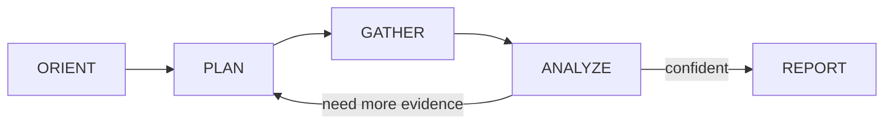
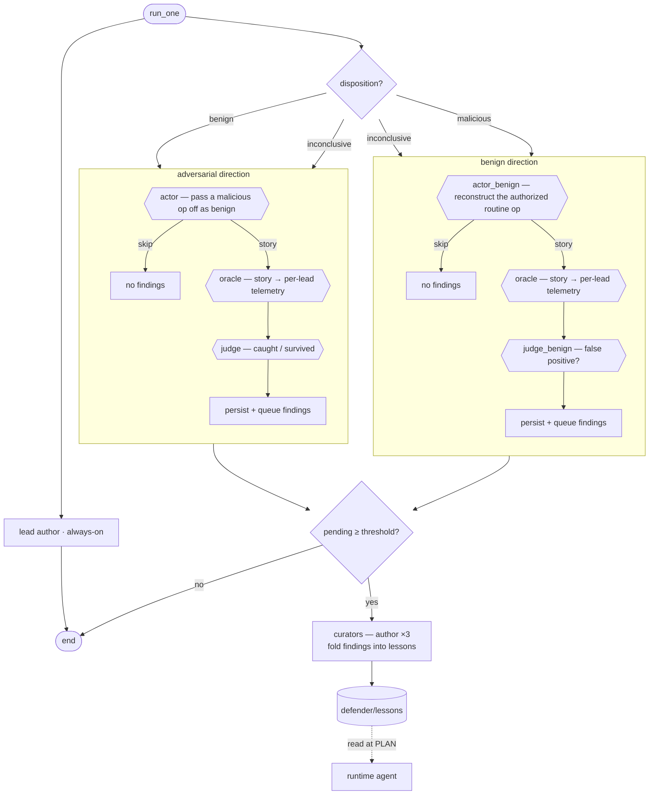

# defender

This repository centers on `defender/`, an alert-triage agent, built around a learning loop.

The idea is to provide the agent with a structured way to identify its runtime mistakes and learn from them. That way, the system improves over time, just from running by itself. Depending on the disposition, a counterfactual actor is launched — an adversary for `benign` verdicts, a benign ops person for `malicious` ones — writing a story aimed to undermine the defender's investigation: bypass or disprove it. The actor is gray-box: it sees which queries the defender ran, but never the defender's goals or the raw payloads. A judge reviews the story and its generated telemetry against the investigation, and identifies gaps in both, creating seeds for an author to turn into validated lessons.

> **Status: experimental / PoC.** The learning loop is the headlining experiment. It has proven its value end-to-end on real cases, so the earlier "runtime reliability gates are out of scope" stance is lifted: the permission/validation gates now run in-process inside the PydanticAI runtime driver (see `defender/CLAUDE.md`).

## What This Project Contains

- `defender/`: the runtime triage agent, its skills/adapters, and the offline learning loop
- `defender/learning/`: actor / oracle / judge / forward-check / author pipeline + eval harness + read-only frontend
- `defender/lessons/`: checked-in pitfall lessons authored by the loop, read by the agent at plan time
- `defender/fixtures/`: alert inputs used to drive runs
- `playground-v2/`: the SOC lab the defender runs against — a Docker Compose stack (Elastic/Fleet, Keycloak, Zeek, Falco, role hosts with baseline-activity generators, attack runner) on a Hetzner VPS
- `infra/`: Terraform for that VPS, with snapshot lever-up/lever-down scripts for cost control
- `playground/`: the superseded v1 lab (Wazuh-era); its `ticket-server/` is still reused by v2
- `dev-orchestrator/`: meta-tooling, not part of the security agent — a spec-first SQLite state-machine service (TypeScript/Bun) that orchestrates the Claude-Code-driven dev workflow used to build this repo

## Runtime Loop

A single agent — driven by the in-process PydanticAI runtime (`defender/runtime/driver.py`) with `defender/SKILL.md` as its system prompt — works one alert through explicit phases. The common case is a few iterations of `PLAN → GATHER → ANALYZE` before `REPORT`; ANALYZE loops back to PLAN only when the next move is genuinely undecided.



`GATHER` is dispatched to a cheap subagent per lead (single-agent ES|QL, Kimi K2.6 by default); the main agent works from the summary and reads raw payloads on demand. The run emits `investigation.md` (the dense audit log, written in **invlang** — the project's structured investigation notation; see `defender/skills/invlang/`), `report.md` (disposition + one paragraph), and two live append-only tables the learning loop consumes: the leads table (`gather_raw/{lead_id}.lead.json`) and the queries table (`executed_queries.jsonl`), both written by the harness as the agent dispatches gather — no post-run projection.

`defender/SKILL.md` is the spec for this loop. The on-disk shape and two-table contract are documented in `defender/CLAUDE.md`.

## Learning Loop

The learning loop runs off-process: after the runtime loop exits, `run.py` drops a learn-queue marker (skip with `--no-learn`), and a worker drains the queue via `defender/learning/loop.py --learn-drain`. The disposition routes each run into one or both counterfactual directions — hexagons are in-process LLM stages (PydanticAI), rectangles are deterministic code:



The branch is the point: each disposition is probed with the opposite counterfactual. A `benign` verdict is tested adversarially (did the run miss a real attack?); a `malicious` verdict is tested with the benign actor (was it a false positive?); `inconclusive` runs both. Within a direction the oracle sits between actor and judge so the judge isn't grading its own imagination, and the actor can `skip` when it can't construct a coherent story. Curators fire once `_pending` reaches `LEARNING_AUTHOR_THRESHOLD` (default 5), folding queued findings into the lessons corpora and committing.

Lessons feed back in: at `PLAN` time the agent enumerates `defender/lessons/*.md` frontmatter and reads the bodies relevant to the current alert.

Design rationale lives in `defender/docs/` — start with `defender/docs/learning-loop.md` (the RL / evolutionary-algorithms framing the architecture borrows from). When a doc and the code disagree, the code wins.

## Quick Start

Defender has its own venv at `defender/.venv` (core dep is just `pyyaml`; the runtime loop needs the `runtime` extra — PydanticAI + duckdb):

```bash
cd defender && uv venv .venv && uv pip install --python .venv/bin/python -e '.[dev,runtime]'
```

`run.py` re-execs into `defender/.venv/bin/python3`, so it works regardless of which python is on PATH.

Live runs additionally need a provider API key (Anthropic by default; Fireworks for the GLM/Kimi paths) and the SIEM/host adapters reachable (see `defender/skills/{system}/SKILL.md`). The learning loop's stages run in-process on PydanticAI too, billing the same provider key — there is no separate `claude` CLI dependency.

## Running The Agent

Investigate one alert end-to-end (runtime loop + post-steps + learning loop):

```bash
python3 defender/run.py <alert.json>
```

Notes:

- run dirs are created under `$DEFENDER_RUNS_BASE/{run_id}/` (default `/tmp/defender-runs/`), outside the repo
- pass `--no-learn` to skip enqueuing the learning step while iterating on the runtime loop only
- the learning loop runs off-process — a worker drains the queue with `python3 defender/learning/loop.py --learn-drain`; run one dir directly with `python3 defender/learning/loop.py <run_dir>`

Each run dir contains at least `alert.json`, `investigation.md`, `report.md`, `executed_queries.jsonl`, `llm_requests.jsonl`, `tool_trace.jsonl`, `transcript.html`, and a `gather_raw/` directory of lead sidecars + per-query payloads.

## Learning-Loop Frontend

A read-only posture view of the loop's current output:

```bash
python3 defender/learning/frontend/build.py
```

Nicer reading experience.

## Tests

The runtime agent has no unit tests — it's evaluated by running real alerts and reviewing the run dir, plus a hermetic e2e replay suite (`defender/tests/test_replay_*`, run with `-m e2e`; no API key needed). `defender/tests/` also covers learning-loop invariants (lesson schema, author pre/post-flight, atomic writes, forward-check):

```bash
cd defender && .venv/bin/python -m pytest tests/ -q -m "not llm and not live"
```

The `llm`/`live` markers gate tests that make a real (metered) model request or need live
infrastructure; CI runs `-m "not llm and not live"`.

## Repository Conventions

- **Experiments** — keepworthy findings live in `experiments/{name}/` (writeup +
  load-bearing artifacts). Throwaway probes go in a git worktree under
  `.claude/worktrees/{branch}/`, never new top-level scratch dirs; promote to
  `experiments/` only with a writeup, otherwise discard.
- **Tasks** — open work is tracked as [GitHub issues](../../issues). Design
  records for in-flight or load-bearing decisions live under `docs/decisions/`.
- **Per-area guidance** — `defender/CLAUDE.md` (agent runtime contracts + a
  "where to make changes" map), `playground-v2/CLAUDE.md` (the dev/eval stack),
  `infra/CLAUDE.md`. There is no repo-root CLAUDE.md.

## Where To Start Reading

- `defender/SKILL.md` — the runtime agent spec
- `defender/CLAUDE.md` — on-disk contracts, run-dir layout, and a "where to make changes" map
- `defender/skills/handbook/` — on-demand reference for the whole defender (design, both loops, run artifacts, skills + lessons, invlang); read-only, question-driven
- `defender/learning/loop.py` — the offline loop orchestrator
- `defender/docs/learning-loop.md` — design rationale
