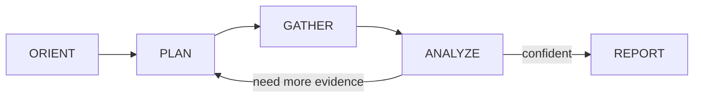
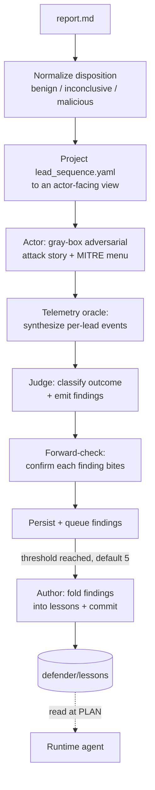

# defender

This repository centers on `defender/`, an exploratory alert-triage agent built around a **self-improving learning loop**.

The core bet: don't hand-tune a triage prompt forever. Run real alerts through a phase-disciplined investigation agent, then mine each run offline — an adversarial actor invents an attack story the run might have missed, a telemetry oracle synthesizes the events that story would have produced, a judge decides whether the investigation would have caught it, and a curator folds the surviving findings back into a checked-in lessons corpus the agent reads on its next run. The agent's job is to generate honest signal; the loop discovers what it should have known.

> **Status: experimental / PoC.** The learning loop is the headlining experiment. Runtime reliability gates (hooks, validators, judge gates) are deliberately out of scope until the loop proves itself end-to-end on real cases.

## What This Project Contains

- `defender/`: the runtime triage agent, its skills/adapters, and the offline learning loop
- `defender/learning/`: actor / oracle / judge / forward-check / author pipeline + eval harness + read-only frontend
- `defender/lessons/`: checked-in pitfall lessons authored by the loop, read by the agent at plan time
- `defender/fixtures/`: alert inputs used to drive runs
- `playground/` and `playground-v2/`: security lab scenarios and local simulation assets

## Runtime Loop

A single agent works one alert through explicit phases. The common case is a few iterations of `PLAN → GATHER → ANALYZE` before `REPORT`; ANALYZE loops back to PLAN only when the next move is genuinely undecided.



`GATHER` is dispatched to a cheap subagent (Haiku) per query; the main agent works from the summary and reads raw payloads on demand. The run emits three artifacts: `investigation.md` (the dense audit log), `lead_sequence.yaml` (the machine-readable contract the learning loop consumes), and `report.md` (disposition + one paragraph).

`defender/SKILL.md` is the spec for this loop. The on-disk shape and projection contract are documented in `defender/CLAUDE.md`.

## Learning Loop

After the runtime loop exits, `run.py` hands the run dir to the offline loop (skip with `--no-learn`):



- **Normalize** disposition from `report.md` frontmatter (`benign | inconclusive | malicious`).
- **Actor** (gray-box, adversarial) is given the alert, the lead set, an `internal`/`external` archetype, and a sampled MITRE ATT&CK technique menu, and writes a candidate attack story citing the techniques it used.
- **Telemetry oracle** sits between actor and judge so the judge isn't grading its own imagination.
- **Judge** classifies the outcome (`caught | survived | undecidable | incoherent | skip-passthrough`).
- **Author** fires once `_pending` reaches `LEARNING_AUTHOR_THRESHOLD` (default 5), folding queued findings into `defender/lessons/*.md`.

Lessons feed back in: at `PLAN` time the agent enumerates `defender/lessons/*.md` frontmatter and reads the bodies relevant to the current alert.

Design rationale lives in `defender/docs/` — start with `defender/docs/learning-loop.md` (the RL / evolutionary-algorithms framing the architecture borrows from). When a doc and the code disagree, the code wins.

## Quick Start

Defender has its own venv at `defender/.venv` (only runtime dep is `pyyaml`):

```bash
cd defender && uv venv .venv && uv pip install --python .venv/bin/python -e '.[dev]'
```

`run.py` re-execs into `defender/.venv/bin/python3`, so it works regardless of which python is on PATH.

Live runs additionally need the `claude` CLI installed and authenticated, plus the SIEM/host adapters reachable (see `defender/skills/{system}/SKILL.md`).

## Running The Agent

Investigate one alert end-to-end (runtime loop + post-steps + learning loop):

```bash
python3 defender/run.py <alert.json>
```

Notes:

- run dirs are created under `$DEFENDER_RUNS_BASE/{run_id}/` (default `/tmp/defender-runs/`), outside the repo
- pass `--no-learn` to skip the learning step while iterating on the runtime loop only
- the learning loop can also run standalone: `python3 defender/learning/loop.py <run_dir>`

Each run dir contains at least `alert.json`, `investigation.md`, `lead_sequence.yaml`, `report.md`, `tool_trace.jsonl`, `transcript.html`, and a `gather_raw/` directory of per-query payloads.

## Learning-Loop Frontend

A read-only posture view of the loop's current output:

```bash
python3 defender/learning/frontend/build.py
```

Nicer reading experience.

## Tests

The runtime agent has no unit tests — it's evaluated by running real alerts and reviewing the run dir. `defender/tests/` covers learning-loop invariants (lesson schema, author pre/post-flight, atomic writes, forward-check):

```bash
cd defender && .venv/bin/python -m pytest tests/ -q
```

## Where To Start Reading

- `defender/SKILL.md` — the runtime agent spec
- `defender/CLAUDE.md` — on-disk contracts, run-dir layout, and a "where to make changes" map
- `defender/learning/loop.py` — the offline loop orchestrator
- `defender/docs/learning-loop.md` — design rationale
