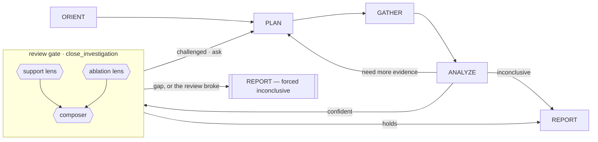
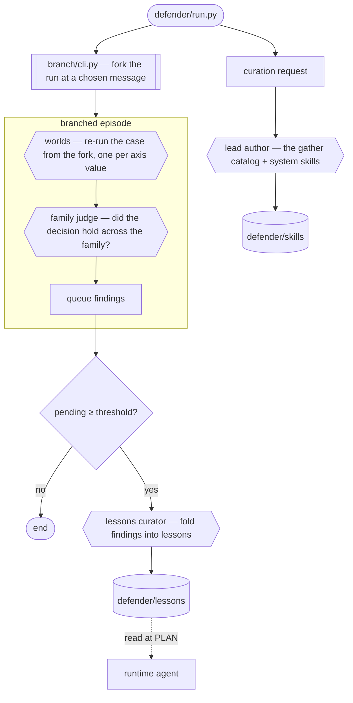

# defender

This repository centers on `defender/`, an alert-triage agent, built around a learning loop.

The idea is to give the agent a structured way to identify its runtime mistakes and learn from them, so the system improves over time from the cases it actually works. A finished investigation is forked at a chosen turn and re-run as a family of sibling worlds: one continues against the evidence exactly as it was (the control), and each of the others continues against a world that differs by one deliberately authored fact — the host really is a jump box, the account really was rotated. Every sibling shares the same alert, history and partial reasoning up to the branch point; from there they diverge only in what the evidence says, and every answer a sibling receives is served by a real system and recorded. A judge grades each counterfactual sibling against its own record — what it queried, what it was served, what it concluded — and localizes where a verdict lost the deciding fact: never queried the system holding it, queried at the wrong scope, received the changed answer and reasoned past it, or established it and did not let it move the verdict. Those findings queue for a curator that turns them into validated lessons, each gated by a forward-check before it lands.

> **Status: experimental / PoC.** The learning loop is the headlining experiment. It has proven its value end-to-end on real cases, so the earlier "runtime reliability gates are out of scope" stance is lifted: the permission/validation gates now run in-process inside the PydanticAI runtime driver (see `defender/CLAUDE.md`).

## What This Project Contains

- `defender/`: the runtime triage agent, its skills/adapters, and the offline learning loop
- `defender/learning/`: the branched-episode loop (questioner / staged estate / review by replay / family judge), the curators and their forward-check, and the read-only frontend
- `defender/lessons/`: checked-in pitfall lessons authored by the loop, read by the agent at plan time
- `defender/fixtures/`: alert inputs used to drive runs
- `playground-v2/`: the SOC lab the defender runs against — a Docker Compose stack (Elastic/Fleet, Keycloak, Zeek, Falco, role hosts with baseline-activity generators, attack runner) on a Hetzner VPS
- `infra/`: Terraform for that VPS, with snapshot lever-up/lever-down scripts for cost control
- the v1 lab (Wazuh-era) has been retired and deleted; its `ticket-server/` lives on at `playground-v2/ticket-server/`
- `spec-flow/`: meta-tooling, not part of the security agent — the Claude Code plugin whose skills drive the spec-first dev workflow used to build this repo

## Runtime Loop

A single agent — driven by the in-process PydanticAI runtime (`defender/runtime/driver/`) with `defender/SKILL.md` as its system prompt — works one alert through explicit phases. The common case is a few iterations of `PLAN → GATHER → ANALYZE` before `REPORT`; ANALYZE loops back to PLAN only when the next move is genuinely undecided.

A **confident** close is not committed on the agent's say-so: it passes a write-time **review gate** first (hexagons are in-process LLM roles, as in the learning-loop diagram below). The gate is not a phase — the investigator never occupies it, and it can hand the close back for another loop.


```mermaid
flowchart LR
    ORIENT --> PLAN
    PLAN --> GATHER
    GATHER --> ANALYZE
    ANALYZE -->|need more evidence| PLAN
    ANALYZE -->|inconclusive| REPORT
    ANALYZE -->|confident| GATE

    subgraph GATE ["review gate · close_investigation"]
      direction TB
      SUP{{"support lens"}}
      ABL{{"ablation lens"}}
      SUP --> CMP{{composer}}
      ABL --> CMP
    end

    GATE -->|holds| REPORT
    GATE -->|challenged · ask| PLAN
    GATE -->|gap, or the review broke| RI[["REPORT — forced inconclusive"]]
```

Both lenses are **blind**: they read the investigation's observations (`:V`/`:E`/`:R`/`:H`/`:L`) with the belief movement (`:T`) pruned out, so they reconstruct what the evidence supports rather than agreeing with the write-up. The ablation is the support lens re-asked with one load-bearing edge withheld, which measures how much the close rests on a single edge. A review that cannot run **fails closed** — the confident disposition is recorded `inconclusive`. See `defender/runtime/challenge_gate.py` and `defender/runtime/review/`.

`GATHER` is dispatched to a cheap subagent per lead (single-agent ES|QL, GLM 5.3 Flash by default); the main agent works from the summary and reads raw payloads on demand. The run emits `investigation.md` (the dense audit log, written in **invlang** — the project's structured investigation notation; see `defender/skills/invlang/`), `report.md` (disposition + one paragraph), and two live append-only tables the learning loop consumes: the leads table (`gather_raw/{lead_id}.lead.json`) and the queries table (`executed_queries.jsonl`), both written by the harness as the agent dispatches gather — no post-run projection.

`defender/SKILL.md` is the spec for this loop. The on-disk shape and two-table contract are documented in `defender/CLAUDE.md`.

## Learning Loop

The learning loop runs off-process. A finished investigation contributes to it in two ways,
and neither happens on the run's own critical path: `run.py` queues a curation request for the
lead author (skip with `--no-learn`), and the run can later be FORKED into a branched episode
that grades what a different decision would have produced. Two drains, each one drainer at a
time, turn those into committed knowledge — hexagons are in-process LLM stages (PydanticAI),
rectangles are deterministic code:


```mermaid
flowchart TD
    R([defender/run.py]) --> Q[curation request]
    R --> EP[["branch/cli.py — fork the run at a chosen message"]]

    subgraph FAM [branched episode]
      direction TB
      W{{"worlds — re-run the case from the fork, one per axis value"}}
      W --> J{{"family judge — did the decision hold across the family?"}}
      J --> APP[queue findings]
    end

    EP --> FAM
    APP --> T{pending ≥ threshold?}
    T -->|no| E([end])
    T -->|yes| CUR{{"lessons curator — fold findings into lessons"}}
    CUR --> L[(defender/lessons)]
    L -.->|read at PLAN| RT[runtime agent]

    Q --> LA{{"lead author — the gather catalog + system skills"}}
    LA --> CAT[(defender/skills)]
```

The branch is the point: instead of imagining a counterfactual, the episode RE-RUNS the case
from a real fork point and grades the family of outcomes against each other, so the judge is
reading evidence a run actually produced. The lessons curator fires once `_pending` holds
`LEARNING_AUTHOR_THRESHOLD` (default 5) findings it could actually author — a row the gate has
held stays queued and counts for nothing — then folds them into the corpus and opens a PR;
the lead author drains its own queue on the same discipline.

`defender/learning/loop.py --author-drain` and `--lead-author-drain` are the two entry points.

Lessons feed back in: at `PLAN` time the agent enumerates `defender/lessons/*.md` frontmatter
and reads the bodies relevant to the current alert.

**What left in #922.** A four-role pipeline (two actors, an oracle, a judge) used to run over
each finished run, imagining the counterfactual rather than executing it: it authored a story,
projected the telemetry that story would have produced, and graded itself against both. It is
deleted, along with the learn queue, its drain, and the two sibling corpora it fed
(`lessons-actor/`, `lessons-environment/`, whose authored lessons are left in place and read by
nothing). `git show e9e11a48` is the account of the deletion; the design docs that describe
the old pipeline carry a status banner saying so. When a doc and the code disagree, the code
wins.

Design rationale lives in `defender/docs/` — start with `defender/docs/learning-loop.md` (the
RL / ablation-study framing the architecture borrows from).

## Quick Start

Defender has its own venv at `defender/.venv` (core dep is just `pyyaml`; the runtime loop needs the `runtime` extra — PydanticAI + duckdb):

```bash
cd defender && uv venv .venv && uv pip install --python .venv/bin/python -e '.[dev,runtime]'
```

`run.py` re-execs into `defender/.venv/bin/python3`, so it works regardless of which python is on PATH.

Live runs additionally need a provider API key (Anthropic by default; Fireworks for the GLM/Kimi paths) and the SIEM/host adapters reachable (see `defender/skills/{system}/SKILL.md`). The learning loop's stages run in-process on PydanticAI too, billing the same provider key — there is no separate `claude` CLI dependency.

## Running The Agent

Investigate one alert end-to-end (runtime loop + post-steps + learning loop):

```bash
python3 defender/run.py <alert.json>
```

Notes:

- run dirs are created under `$DEFENDER_RUNS_BASE/{run_id}/` (default `/tmp/defender-runs/`), outside the repo
- pass `--no-learn` to skip the catalog-curation enqueue, the one automatic post-step, while iterating on the runtime loop only
- the learning loop runs off-process and is operator-initiated: fork a finished run with `python3 defender/learning/branch/cli.py <run_dir> <branch_message_id>`, then fold the queued findings with `python3 defender/learning/loop.py --author-drain` (`--lead-author-drain` serves the catalog-curation queue)

Each run dir contains at least `alert.json`, `investigation.md`, `report.md`, `executed_queries.jsonl`, `tool_trace.jsonl`, `runtime.html`, an `wire_logs/` directory holding the run's wire log (`llm_requests.jsonl`), and a `gather_raw/` directory of lead sidecars + per-query payloads.

## Learning-Loop Frontend

A read-only posture view of the loop's current output:

```bash
python3 defender/learning/frontend/build.py
```

Nicer reading experience.

## Tests

The runtime agent has no unit tests — it's evaluated by running real alerts and reviewing the run dir, plus a hermetic e2e replay suite (`defender/tests/test_replay_*`, run with `-m e2e`; no API key needed). `defender/tests/` also covers learning-loop invariants (lesson schema, author pre/post-flight, atomic writes, forward-check):

```bash
cd defender && .venv/bin/python -m pytest tests/ -q -m "not llm and not live"
```

The `llm`/`live` markers gate tests that make a real (metered) model request or need live
infrastructure; CI runs `-m "not llm and not live"`.

## Repository Conventions

- **Experiments** — keepworthy findings live in `experiments/{name}/` (writeup +
  load-bearing artifacts). Throwaway probes go in a git worktree under
  `.claude/worktrees/{branch}/`, never new top-level scratch dirs; promote to
  `experiments/` only with a writeup, otherwise discard.
- **Tasks** — open work is tracked as [GitHub issues](../../issues). Design
  records for in-flight or load-bearing decisions live under `docs/decisions/`.
- **Per-area guidance** — `defender/CLAUDE.md` (agent runtime contracts + a
  "where to make changes" map), `playground-v2/CLAUDE.md` (the dev/eval stack),
  `infra/CLAUDE.md`. There is no repo-root CLAUDE.md.

## Where To Start Reading

- `defender/SKILL.md` — the runtime agent spec
- `defender/CLAUDE.md` — on-disk contracts, run-dir layout, and a "where to make changes" map
- `defender/skills/handbook/` — on-demand reference for the whole defender (design, both loops, run artifacts, skills + lessons, invlang); read-only, question-driven
- `defender/learning/loop.py` — the offline loop orchestrator
- `defender/docs/learning-loop.md` — design rationale
