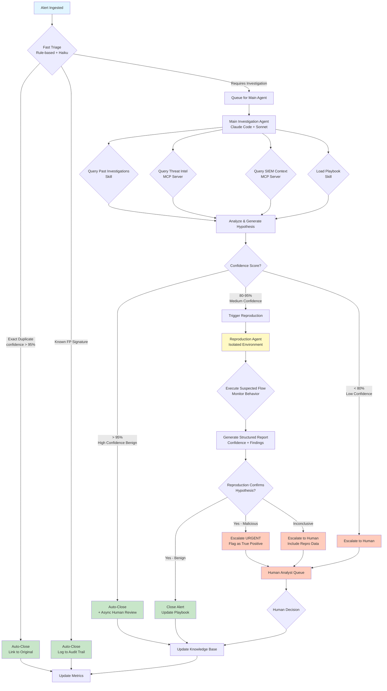

# Cyber Response Agent - Design Document

## Executive Summary

An automated cyber security response system designed to address alert fatigue by automatically resolving false positives, duplicate alerts, and repetitive issues. The system leverages Claude Code with subagents, skills, hooks, and MCP servers to assist SOC analysts with high-volume, low-complexity alerts while escalating uncertain cases to humans.

---

## Assumptions

### Operational Context
- **Alert volume**: Reasonable rate (not sustained >10 alerts/second)
- **Alert positioning**: System operates at SIEM/SOAR level, before human analyst review
- **Threat model**: Majority of false positive alerts stem from benign activity by legitimate accounts or minor policy violations by legitimate users
- **Infrastructure**: Ability to provision isolated compute environments (Docker/gVisor) for reproduction
- **Integration**: Read-only access to SIEM, EDR, ticketing systems, and threat intelligence feeds available

### Alert Characteristics
- Alerts are structured objects with consistent schema
- Historical alert data and investigation outcomes are available
- Alert metadata includes: source, destination, user, process, indicators, timestamps, severity
- Duplicate detection is feasible via signature matching and semantic similarity

### Organizational Constraints
- Human analysts are available for escalation and review
- Initial deployment will include human approval loops
- System has access to organizational playbooks and past investigations
- Security policies allow automated read-only investigation

---

## Goals

### Primary Objectives

1. **Zero False Negatives** (Hard Requirement)
   - No legitimate security threats should be auto-closed
   - Conservative bias: when uncertain, escalate to human
   - Multiple validation layers required before auto-closure

2. **Mean Time to Resolution (TTR): Several Minutes**
   - Target: 1-3 minutes for simple/duplicate alerts
   - Target: 3-5 minutes for complex investigations requiring reproduction
   - Must be faster than human analyst average

3. **High Precision for Auto-Closure**
   - Initial target: >95% precision for auto-closed alerts
   - Acceptable false positive closure rate increases as confidence improves
   - Track and improve over time via feedback loops

### Secondary Objectives

- **Alert volume reduction**: Automatically handle 60-80% of incoming alerts
- **Analyst productivity**: Free analysts to focus on novel/complex threats
- **Knowledge base growth**: System learns from investigations and improves over time
- **Audit trail**: Full visibility into agent decisions for compliance and review
- **Scalability**: Handle organizational growth without linear resource increases

---

## Domain & Context

### Problem Space: Alert Fatigue

SOC analysts face overwhelming alert volumes where:
- 60-70% are false positives or duplicates
- Same issues trigger repeated alerts
- Analysts spend significant time on routine triage
- Novel threats are buried in noise
- Response times suffer due to volume

### Alert Categories

1. **Known False Positives**
   - Legitimate business processes triggering rules
   - Development/testing activities
   - Misconfigured detection rules
   - **Handling**: Auto-close with audit trail

2. **Exact Duplicates**
   - Same alert signature, same context
   - Already investigated recently
   - **Handling**: Aggregate and link to original investigation

3. **Semantic Duplicates**
   - Similar indicators, different signatures
   - Same root cause, different symptoms
   - **Handling**: Correlate and investigate once

4. **Repetitive Issues**
   - Known patterns with established playbooks
   - Confirmed benign but recurring
   - **Handling**: Automated investigation + closure if pattern matches

5. **Novel/Complex Alerts**
   - First occurrence
   - Indicators suggest potential threat
   - Requires deep investigation
   - **Handling**: Escalate to human analyst

### Key Stakeholders

- **SOC Analysts**: Primary users, receive escalations, provide feedback
- **Security Operations Manager**: Oversees performance, approves policy changes
- **Incident Response Team**: Handles escalated threats
- **Compliance/Audit**: Reviews agent decisions and audit trails

---

## System Architecture Overview

### Core Components

1. **Fast Triage Layer**
   - Rule-based duplicate detection
   - Known false positive signature matching
   - Lightweight LLM classification (Claude Haiku)
   - Handles 60-70% of alerts in <30 seconds

2. **Main Investigation Agent**
   - Claude Code + Claude Sonnet
   - Access to past investigations via skills
   - Access to SIEM/TI via MCP servers
   - Generates investigation hypothesis and confidence score

3. **Reproduction Agent**
   - Isolated environment (Docker/gVisor/Kata)
   - No outbound network access
   - Limited to context provided by investigation agent
   - Executes suspected flow to validate hypothesis
   - Returns structured JSON report

4. **Knowledge Base**
   - Past investigation outcomes
   - Organizational playbooks
   - Known false positive patterns
   - Continuously updated via feedback loop

5. **Guardrails & Audit System**
   - Multi-layer input/output validation
   - Action constraints and approval workflows
   - Comprehensive logging and metrics
   - Circuit breakers for anomaly detection

---

## Request Flow

### High-Level Flow

```
Alert Ingestion → Fast Triage → Investigation Agent → Reproduction (if needed) → Disposition
                      ↓              ↓                      ↓                       ↓
                  Auto-close    Enrich context    Validate hypothesis    Close/Escalate/Update KB
```

### Detailed Flow Diagram



### Flow States Explained

#### 1. Alert Ingestion
- **Input**: Structured alert object from SIEM/EDR
- **Processing**: Schema validation, rate limiting check
- **Output**: Validated alert object + unique ID + timestamp

#### 2. Fast Triage (Rule-Based + Haiku)
- **Duration**: <10 seconds
- **Logic**:
  - Exact signature match against recent alerts → Duplicate
  - Signature match against known FP database → Auto-close
  - Quick LLM classification (Haiku) for obvious cases
- **Output**: Auto-close (70%) OR Forward to Main Agent (30%)

#### 3. Main Investigation Agent
- **Duration**: 15-30 seconds
- **Process**:
  1. Query past investigations (skill) - semantic similarity search
  2. Query threat intelligence (MCP) - IOC reputation, campaigns
  3. Query SIEM (MCP) - additional context, related events
  4. Load relevant playbook (skill) - investigation steps
  5. Analyze all data and generate hypothesis
  6. Calculate confidence score with justification
- **Output**: Hypothesis + Confidence (0-100%) + Investigation report

#### 4. Confidence-Based Routing
- **High (>95%)**: Auto-close with async human audit review
- **Medium (80-95%)**: Trigger reproduction for validation
- **Low (<80%)**: Escalate to human with investigation context

#### 5. Reproduction Agent (if triggered)
- **Duration**: 30-90 seconds
- **Process**:
  1. Receive: Alert metadata + hypothesis + reproduction steps (from main agent)
  2. Provision isolated environment (pre-warmed container)
  3. Execute suspected flow with monitoring:
     - Process execution
     - Network activity (local only)
     - File system changes
     - System calls
  4. Compare observed behavior to hypothesis
  5. Generate structured report
- **Constraints**:
  - No outbound network access
  - No read access to real systems
  - Ephemeral storage only
  - Resource limits (CPU, memory, time)
- **Output**: JSON report with confidence score + observed behaviors

#### 6. Final Disposition
- **Close**: Update knowledge base, log to audit trail, close ticket
- **Escalate**: Add to human analyst queue with full investigation context
- **Update KB**: Feed successful investigations into playbook and past investigations

#### 7. Feedback Loop
- Human analyst decisions are captured and used to:
  - Refine confidence thresholds
  - Update playbooks
  - Improve similarity matching
  - Train future agent behavior

### Performance Targets by Flow Path

| Path | % of Alerts | Target TTR | Components |
|------|-------------|------------|------------|
| Exact Duplicate | 30-40% | <20s | Fast Triage only |
| Known FP | 20-30% | <20s | Fast Triage only |
| High Confidence (no repro) | 10-15% | 30-60s | Fast Triage + Main Agent |
| Medium Confidence (with repro) | 5-10% | 60-180s | Fast Triage + Main Agent + Reproduction |
| Escalated | 10-20% | N/A (human) | Varies + Human Analyst |

**Overall Mean TTR Target**: 45-90 seconds (weighted average)

---

## Key Design Principles

### 1. Conservative by Default
- When in doubt, escalate
- Multiple validation layers before auto-closure
- Human review remains the ultimate authority

### 2. Isolation & Security
- Reproduction environments are fully isolated
- Minimal privileges for all agents
- Structured, validated outputs only
- No credentials in LLM context

### 3. Transparency & Auditability
- Every decision is logged with full justification
- Humans can replay investigations
- Metrics tracked continuously
- Audit trail for compliance

### 4. Continuous Learning
- Knowledge base evolves from successful investigations
- Human feedback improves agent behavior
- Playbooks are refined based on outcomes
- System becomes more accurate over time

### 5. Fail-Safe Architecture
- Circuit breakers detect anomalies
- Graceful degradation when components fail
- Manual override always available
- No single point of failure for escalation path

---

## Success Metrics

### Operational Metrics
- **Mean Time to Resolution (TTR)**: Target <3 minutes
- **Auto-closure rate**: Target 60-80% of total alerts
- **Escalation rate**: Target 10-20% of total alerts
- **Human review override rate**: Target <5% of auto-closures

### Quality Metrics
- **Precision**: % of auto-closures that were correct (target >95%)
- **Recall**: % of true alerts NOT auto-closed (target 100%)
- **False negative rate**: Target 0% (hard requirement)
- **False positive closure rate**: Target <5% initially, improving over time

### Performance Metrics
- **P50 TTR**: Target <60s
- **P95 TTR**: Target <180s
- **Reproduction success rate**: % of reproductions that complete without error (target >90%)
- **System availability**: Target >99.5%

### Business Metrics
- **Analyst time saved**: Hours per week freed from routine triage
- **Alert backlog**: Reduction in queued alerts
- **Novel threat detection time**: Improvement in time-to-detection for real threats
- **Cost per alert processed**: Operational cost efficiency

---

## Next Steps

1. **Phase 1**: Prototype main investigation agent with skills and MCP servers
2. **Phase 2**: Implement reproduction agent in isolated environment
3. **Phase 3**: Deploy in shadow mode with human validation
4. **Phase 4**: Gradual rollout of auto-closure with conservative thresholds
5. **Phase 5**: Scale and optimize based on metrics

---

## Document Version
- **Version**: 1.0
- **Date**: 2025-11-18
- **Status**: Initial Design
