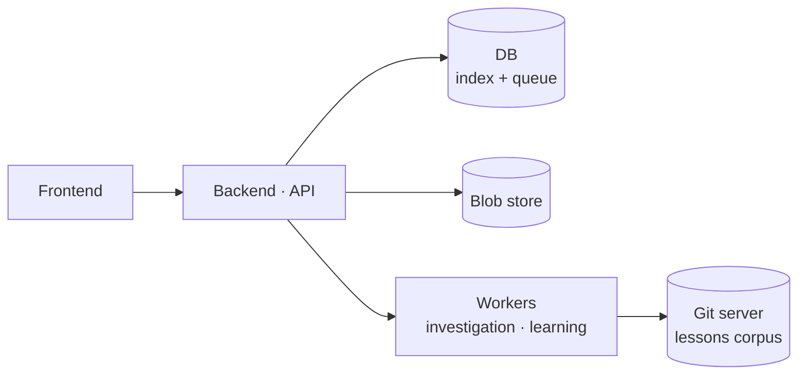
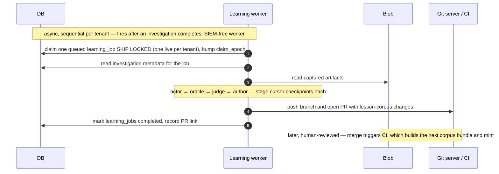

# Defender Platform Design

**Version:** 0.3 · **Status:** Draft — design record, not yet implemented · **Date:** June 2026

A design record for productionising the defender agent: turning today's manual Python scripts (which
render local investigation-artifact directories) into a system with APIs, a frontend, a real data layer,
and per-investigation containers. It captures _what_ we decided, _why_, and what is deliberately deferred
(§6). Where a section settles a build-it-this-way choice, the rejected alternative and its graduation
trigger are kept inline — that rationale is the point.

---

## 1. Requirements

### 1.1 Context

We operate _on top of_ a SIEM that owns the remote alerts. The platform is a thin control plane: it
indexes those alerts, runs the defender agent against them in isolated containers, projects results into
a queryable store, and feeds completed runs into a separate learning loop. Defender is **recommend-only**
— it produces a disposition + confidence, it does not act (no `close_ticket`, `block_ip`, …).

### 1.2 Functional requirements (surfaces)

| Surface                                                        | Nature                                                                                                          |
| ------------------------------------------------------------- | ------------------------------------------------------------------------------------------------------------- |
| Investigate / rerun (`POST /investigations`)                  | **write** — start an execution for an existing local `alert_id`; a rerun is the same call once all priors have terminated |
| Live investigation view (`GET /investigations/:id`)           | **read (polling)** — job status + heartbeat at ~30s; artifacts after completion                                |
| Alert history / incident review (`GET /alerts…`)              | **read** — DB index, latest-disposition projection, drill-down                                                 |
| Learning outcome + activity (`GET /learning-jobs`, `/lessons`) | **read** — corpora + activity feed                                                                             |
| Re-learn (`POST /learning-jobs`)                              | **write** — fire another learning job                                                                          |

**Most surfaces are reads over a DB index.** That holds cleanly for the **lessons** read (a producer-swap
off the existing `serialize.py`), but **not** for alert/investigation history, which has no current
producer and is net-new (§2.1). The one thing that genuinely shapes the architecture is the **write path**
(alert → investigation → container); that's where the design energy goes. The live view is intentionally
coarse: DB-backed polling of lifecycle + heartbeat, not a token/tool stream.

Normal use is one SIEM alert → one alert row → one investigation. An alert can accrue further
investigations over time (after a bug fix, lessons change, or env change), but at most one is live, and
the rest are sequential reruns through the same endpoint (§3).

### 1.3 Non-functional requirements

- **Bias toward catching real threats over auto-closing:** when uncertain, escalate.
  > _"Zero false negatives" is a design bias, not a guarantee. Treating literal zero as the target is
  > counter-productive — it drives over-escalation and alert fatigue, degrading the precision the product
  > also needs. Read it as "minimize false negatives, accept the precision cost knowingly," tunable per
  > tenant._
- **Scale target:** dozens–hundreds of investigations, each 5–15 min and a few dollars. The DB-as-queue /
  no-Temporal / no-broker choices are calibrated to this and graduate explicitly (§6).
- **Tenant isolation from day one:** schema, blob keys, queue claims, and secret lookups all carry
  `tenant_id` even with one tenant (§2.2, §4.7).
- **Reproducibility:** each investigation pins the exact defender image/SHA, model/prompt bundle, and
  lessons-corpus version (§2.8, §4.4).
- **Auditability:** every alert row, investigation, artifact read, investigation start, rerun confirm,
  re-learn, cancellation, and credential change is a tenant-scoped audit event.
- **Crash-safety:** completion is a single commit point; orphans and skipped learning are recovered by
  reconcilers (§4.1).

### 1.4 Vocabulary

Use **alert** and **investigation** as the platform vocabulary — not "case" here, "notable event" there.

- **Remote alert** — the SIEM/vendor object (alert, case, notable event, incident). Normalized to _alert_
  at the boundary.
- **Alert** — our local, lean projection row: PK, source-vendor identity, raw payload, timestamps,
  investigation list, projected latest disposition.
- **Investigation** — one defender execution against an alert: owns `job_status`, artifacts, cost, version
  pins, disposition/confidence, and its current run's infra (all on one row — §4.1).
- **Learning** — the offline, sequential, SIEM-free plane that reads completed investigations and authors
  lesson-corpus changes through review (§3).
- **Learning job** — one unit of learning bound to a completed investigation, with its own lifecycle
  (`queued → running → completed | failed | skipped`) and a `stage` cursor (§2.5).
- **Rerun vs. resume** — a *rerun* is a **new** investigation for the same alert (new `investigation_id`;
  after a fix/lessons/env change). A *resume/recovery* is the **same** investigation re-executed after a
  crash (same `investigation_id`, infra overwritten — §4.1). Never call either an "attempt."

The duplicate word "alert" at the boundary is acceptable; disambiguate with field names: `alert_id` (our
PK), `source_vendor` (upstream system), `remote_alert_id` (upstream id), `raw_alert_json` (payload).

### 1.5 Scope boundary

`POST /investigations` requires an existing local `alert_id` (a **required, validated body field**) and
does **not** resolve raw vendor payloads inline. Alert rows are upserted out of band by the source adapter
(or an explicit ingest step), keyed by `(tenant_id, source_vendor, remote_alert_id)`. The adapter returns
the `alert_id`; the caller passes it in. This keeps investigation creation a pure execution-creation step
and fixes the artifact↔alert binding: the investigation knows its `alert_id` from the request, not from
`report.md` (whose `case_id` is the investigation id, never the alert — §2.3). Everything else out of
scope is in §6.

---

## 2. Data model & API

### 2.1 Stores

- **DB = the index.** One row per alert, one per investigation; the history API reads the DB, **not** a
  filesystem/blob walk. No investigation-history serializer exists today (`serialize.py` walks the _lesson
  corpora_, not run dirs), so this index is **net-new, not a producer swap**. The naive port (glob the run
  prefix + 2 GETs per investigation per page) is exactly what fails at scale.
- **Blob = the heavy artifacts.** Write-once run artifacts (`report.md`, `investigation.md`,
  `tool_trace.jsonl`, `gather_raw/`, `runtime.html`, `lead_sequence.yaml`), fetched only when an
  investigation is opened. The raw alert JSON does **not** live here — it's inline JSONB on the alert row
  (§2.2).

A local artifact dir conflates three roles; the platform splits them onto different substrates: an
append-only **event log** (`tool_trace.jsonl`, `investigation.md`), an **artifact store** (`runtime.html`
~1.2 MB, `gather_raw/`), and the **metadata source** (`report.md` frontmatter). V1 does **not** promote
the event log to a durable stream — the container writes it locally and uploads at completion.

### 2.2 Schema

```
alerts(alert_id PK, tenant_id, source_vendor, remote_alert_id NOT NULL, signature_id, severity,
       title, description, created_at, changed_at, raw_alert_json JSONB,
       latest_investigation_id, latest_disposition, latest_confidence,
       disposition_source, disposition_set_by, disposition_set_at, disposition_reason,
       investigation_count, last_investigated_at, ...)

investigations(investigation_id PK, tenant_id, alert_id FK, investigation_counter, client_request_id,
       job_status, claim_epoch,
       defender_image_digest, defender_git_sha, lessons_corpus_version,
       container_kind, container_handle, claimed_by_worker, lease_expires_at, last_heartbeat_at, cost_so_far,
       disposition, confidence, cost, artifact_manifest, status_detail,
       created_at, started_at, finished_at, ...)

learning_jobs(learning_job_id PK, tenant_id, alert_id FK, investigation_id FK, client_request_id,
       status, stage, claim_epoch,
       claimed_by_worker, lease_expires_at, last_heartbeat_at,
       status_detail, created_at, finished_at, ...)   -- field notes in §2.5
```

**Field notes (alerts + investigations; `learning_jobs` in §2.5).**

- `source_vendor` — upstream system (Wazuh, Splunk, …); part of the identity key `(tenant_id,
  source_vendor, remote_alert_id)` and the per-source secret path (§4.7).
- `created_at` / `changed_at` — the **upstream** alert's timestamps, denormalized for display/sort
  (distinct from our row-audit timestamps, folded into `...`).
- **`raw_alert_json` is inline JSONB, not a blob pointer.** It's the alert's defining input — written once
  by the adapter, read when the alert is opened, typically KB-scale. Inline JSONB is the simpler mental
  model and keeps the ground truth on the row; Postgres TOASTs large values out-of-line, so the only
  discipline is to `SELECT` it on the detail read, not in lists. (Blob spill if alerts routinely exceed
  ~a few MB — §6.)
- `artifact_manifest` — logical artifact keys + sizes + content types + checksums (§2.9). Records _which_
  artifacts exist; URLs are minted per read (no durable signed URLs — they expire and aren't
  access-controlled).
- `latest_*` — the projection fields (§2.4); derived, not authoritative.
- `investigation_counter` — per-alert sequence number (1st, 2nd, … investigation of this alert), for
  display; not an idempotency key.
- `job_status` — the execution **lifecycle** (§2.3), the only progress axis tracked. **No `phase` field** —
  within-run phase is inferred from `investigation.md` headers and that inference is fragile, so the live
  view is heartbeat-based (§4.5).
- `cost` — final cost at completion; live `cost_so_far` is updated on the same row by the heartbeat.
- **Infra is on the row, fenced by `claim_epoch`.** The single `investigations` row carries both durable
  data and the infra/liveness of its *current* run (`container_kind`, `container_handle`,
  `claimed_by_worker`, lease, heartbeat, `cost_so_far`). There is **no attempts table and no queue table**;
  a recovery overwrites the infra columns in place. Mechanism — fencing, reconciler, recovery SQL — in
  §4.1. A `runs` history table graduates only for per-run forensics (§6).

**The alert table is a thin index, not a system-of-record.** Be **loose** on SIEM-owned fields (store the
full payload as opaque `raw_alert_json` JSONB, don't validate; don't mint per-field columns) and **strict**
on ours (tenant scoping, FK, state machine, projections). One JSONB column is the loose-on-SIEM choice;
typed per-field columns drift toward the e2e platform we are not.

**`tenant_id` is in the key space from day one** — identity uniqueness is tenant-scoped, all reads filter
by tenant, blob paths sit under a tenant prefix, secrets resolve by `(tenant_id, source_vendor)`. Avoids
later re-keying of the core audit tables.

### 2.3 Job status vs. disposition

Two axes; keep them distinct. **`job_status`** is the execution lifecycle (the state machine the platform
owns, replacing the dev-era FS-presence heuristic). **`disposition`** is the outcome.

| `job_status`  | Meaning                                                                                                      |
| ------------- | ----------------------------------------------------------------------------------------------------------- |
| `queued`      | Row exists; no container started.                                                                            |
| `running`     | A container owns the investigation and should be heartbeating.                                               |
| `completed`   | Terminal success: blobs uploaded, frontmatter parsed, metadata committed.                                    |
| `unparseable` | Terminal: container exited cleanly but `report.md` frontmatter failed to parse — null disposition + note, artifacts kept. **Blocks learning**; recovery is a fresh investigation (§4.6). |
| `failed`      | Terminal infra/runtime failure; retry is a new investigation.                                                |
| `aborted`     | Terminal intentional stop/cancel, timeout, or supersession.                                                  |

**`disposition`** (`malicious` / `benign` / `inconclusive`) is the outcome. Defender's `report.md`
frontmatter is exactly `{case_id, disposition, confidence}` — free-form YAML with **no write-time
validation**, parsed post-hoc by `_loop_validate._parse_frontmatter` (`disposition` checked in
`normalize_disposition`). (soc-agent's ~11-field schema is richer; this platform targets defender, so the
lean 3-field shape is what we project.) `case_id` is the run-dir name = the **investigation id**, not the
remote alert id; project it → `investigation_id` (replay/eval paths preserve it as `source_case_id` and
mint a real id).

### 2.4 Disposition projection

`latest_disposition` is a **projection** from completed investigations, not an overwritten field. Rule:
**human override first, then the latest completed investigation** (excluding `unparseable`). Latest, not
highest-confidence — confidence isn't comparable across model/prompt versions, and reruns happen
_because_ something changed, so the newer completed run is the more trustworthy one.

`disposition_source` is the field that lets auto-projection coexist with human overrides: `auto` vs.
`human` (with `disposition_set_by`/`_at`/`_reason`). Auto-projection overwrites **only when
`disposition_source = auto`** — a human verdict is sticky. Kept to two values; the earlier
`human_pinned`/`human_manual` split was speculative.

The incident-review screen shows **one row per alert, investigations on drill-down** — mirroring SIEM
incident review. There is no analyst-facing _resolution_ state in v1; if needed later, add
`alerts.review_status` distinct from lifecycle and disposition (§6).

### 2.5 `learning_jobs` table (also the completion outbox)

Learning jobs have their **own** lifecycle (`status: queued → running → completed | failed | skipped`,
with a `stage` cursor — §4.3); never overload it onto the investigation's `job_status`.

In the same transaction that marks an investigation `completed`, insert a `learning_jobs` row
(`status=queued`, `ON CONFLICT DO NOTHING`). **The table is the outbox** — a worker drains queued rows, a
reconciler backfills any `completed` investigation lacking an auto job, so a crash can't silently skip
learning. `unparseable` is excluded.

Learning uses the **same single-table model as investigations** (§4.1): one row carries lifecycle +
`stage` checkpoint + infra, fenced by `claim_epoch`. It is **strictly sequential per tenant** (§4.3), so
structurally it's just an investigation with a cheaper liveness story.

```
learning_jobs(
  learning_job_id  PK,
  tenant_id,                              -- matches the investigation's tenant
  alert_id         FK → alerts,           -- denormalized: "all learning activity for this alert"
  investigation_id FK → investigations,   -- the source execution
  client_request_id nullable,             -- NULL = auto (outbox/reconciler); set = explicit re-learn
  status           queued | running | completed | failed | skipped,
  stage            nullable,              -- durable checkpoint: actor | oracle | judge | author
  claim_epoch,                            -- fences a recovered run (§4.1)
  claimed_by_worker, lease_expires_at, last_heartbeat_at,
  status_detail    nullable,              -- one free-text field: skip reason or error summary
  created_at, finished_at, ...
)
```

- **No `container_*` columns.** Learning has one backend-worker substrate (§4.3), nothing
  substrate-specific to address. Liveness is a coarse lease (no live-view to feed), and recovery needs no
  kill handle: a partitioned zombie self-terminates at its next fenced write (`claim_epoch` → 0 rows,
  §4.1), worst-case wasting one stage.
- **`stage` is the durable checkpoint on the row** — it survives a recovery, so a mid-`author` crash
  resumes at a stage boundary. Unlike investigation `phase`, the stage boundary is a real orchestrator
  seam between LLM calls, so it's reliable to record.
- **One live learning job per tenant** — a partial unique index (at most one `queued`/`running` per
  `tenant_id`) enforces the sequencing that makes corpus authoring conflict-free by construction (§4.4).
  > **Revised (2026-06-09):** with learning decoupled from authoring (§4.3), learning jobs run
  > **concurrently**; the one-live / conflict-free constraint moves to a separate serial **author** job and
  > a learning job's `stage` is `actor | oracle | judge`. The author-job schema (own row + one-live-author
  > index, or a column here) is a follow-up re-thread of this section.
- **No `reason` column** — auto vs. explicit re-learn is exactly `client_request_id IS NULL` vs. set; the
  GET endpoints derive the label (§2.6).
- **Auto creation is deduped; explicit re-learn is not.** Re-learning is cheap and unlimited; only the
  _auto_ path must not double-fire. Partial unique index on auto jobs:
  `UNIQUE (investigation_id) WHERE client_request_id IS NULL AND status IN ('queued','running','completed','skipped')`.
  Explicit re-learns carry a `client_request_id`, dedupe by `UNIQUE (tenant_id, client_request_id)`, and
  coexist.
- **One `status_detail`, not two** — a `skipped` or `failed` job just needs a short note. A `skipped` job
  is a record, not a lock; re-learning is just another job. The one hard block is `unparseable` (§4.6).
- **No durable URLs** — `lessons_corpus_version` resolves to a blob bundle and the PR link is a GitHub URL;
  both are surfaced on the detail endpoint at read time (§2.6).

### 2.6 API surface

Frontend reads + a small write path, all tenant-scoped. **Three flat resource families** (`alerts`,
`investigations`, `learning-jobs`/`lessons`). Each entity has a global id and a flat canonical read.
Creation is a flat verb with the parent as a **required body field** (Stripe-style): investigation-create
takes `alert_id`, learning-job-create takes `investigation_id`. List scoping is a query-param filter, not a
nested path. The only sub-paths are *actions/sub-reads of* one investigation, where the parent is the auth
scope. Alert rows are upserted out of band by the adapter (§1.5), so there's no ingest write here.

```
GET  /alerts                                  alert history / review (list + filter)
GET  /alerts/:id                              one alert + investigation-history drill-down
POST /investigations   { alert_id, client_request_id }       start/rerun for an alert_id
GET  /investigations          ?alert_id=      execution list, optionally scoped to one alert
GET  /investigations/:id                      poll job status + heartbeat (~30s); coarse DB state (§4.5)
POST /investigations/:id/cancel               request an aborted terminal stop (audit event)
GET  /investigations/:id/artifacts/:key       authorized, audited artifact read (§2.9)
POST /learning-jobs    { investigation_id, client_request_id }   fire an explicit re-learn
GET  /learning-jobs    ?alert_id= ?investigation_id=    learning reads + activity feed (newest first)
GET  /learning-jobs/:id                       detail: status, stage, timestamps, corpus version + PR link
GET  /lessons                                 lesson-corpus read
```

**A rerun is not a separate verb** — `POST /investigations` on an alert whose investigations have all
terminated _is_ the rerun (the UI button can say "rerun"); §4.1 covers the live/terminal gating.
`POST /learning-jobs` carries `investigation_id` + `client_request_id` and returns the existing live job
for that id; refused only when the investigation is `unparseable` (a prior `skipped`/`completed` doesn't
block it).

### 2.7 Vendor alert normalization envelope

Require a thin normalized envelope; keep the raw payload as opaque JSONB (§2.2). **Required:** `tenant_id`,
`source_vendor`, `remote_alert_id`, raw payload, display title, display `created_at` (upstream first-seen),
severity and source rule/signature when available. **Optional:** `remote_url`, `description`, entity
anchors, upstream `changed_at`, vendor case labels. **Strict on the envelope, loose on the payload.** A
source that can't supply a stable upstream id mints one in its adapter — the platform does not fingerprint
arbitrary JSON (fuzzy grouping deferred, §6).

### 2.8 Version provenance

Human release names are convenience labels, not reproducibility anchors. Each investigation pins
`defender_image_digest`, `defender_git_sha`, optional `defender_release_channel`, and the resolved
model/prompt-bundle id if it varies independently of the image. `lessons_corpus_version` is CI-minted
(§4.4), never hand-incremented.

### 2.9 Artifact link resolution

API-authorized reads are the product contract. The manifest stores logical keys + metadata, **not**
durable URLs. `GET /investigations/:id/artifacts/:key` authorizes tenant access, audits the read, and
streams the blob or redirects to a short-lived signed URL. `runtime.html` and friends are rewritten so
relative links resolve through that API path.

### 2.10 Auth / RBAC

Tenant identities, authorization at the API boundary; no separate internal user-auth. Coarse roles:
`read` (view), `investigate` (also fire investigations + reruns + re-learns), `write` (administer
tenant/source bindings + credentials). Internal workers use service identity. All writes and artifact
reads are tenant-scoped audit events.

---

## 3. High-level design

A frontend talks to a backend; the backend owns the stores and dispatches work to workers. The interesting
part is the investigation **write path** (its own sequence diagram below); planes, reconciler, secret
manager, and the `ContainerRunner` seam are detailed in §4.



**Two dependent lifecycles, joined by one seam — an investigation's `completed` transition (§4.3):**

- **Investigation** — online serving execution: starts from an alert, holds scoped SIEM creds, gathers
  evidence, writes artifacts, terminates `completed | failed | aborted | unparseable`.
- **Learning** — offline, sequential, SIEM-free execution: starts _only_ after `completed`, reads captured
  artifacts, authors lesson-corpus changes through review. Its failure must never roll back the completed
  investigation.

**Write path.** `POST /investigations` is an **async job, not a synchronous `run.py`**: it creates the
investigation when needed (`job_status=queued`), and returns `{alert_id, investigation_id}` immediately. A
worker spawns a per-investigation container; the container heartbeats coarse progress and on exit uploads
artifacts + flips the row to `completed` (or `unparseable`). Reads are a DB index over what's already
produced; the hard engineering is this write path.

```mermaid
sequenceDiagram
    autonumber
    actor FE as Frontend
    participant API
    participant DB
    participant WK as Worker
    participant CT as Container
    participant BLOB as Blob

    FE->>API: POST /investigations with alert_id, client_request_id
    Note right of API: commit point 1 — initiation
    API->>DB: tx — lock alert, insert investigation queued (live-collapse unique index, no separate queue row)
    API-->>FE: 202 with alert_id, investigation_id

    Note over WK,DB: DB-as-queue — the worker polls, the DB never pushes
    WK->>DB: claim queued investigation SKIP LOCKED, bump claim_epoch, set lease, job_status running
    WK->>CT: spawn, label investigation_id and claim_epoch, inject alert, epoch, scoped creds
    WK->>DB: patch container_handle (fenced on claim_epoch)

    loop every ~30s until exit
        CT->>DB: heartbeat last_heartbeat_at and cost_so_far, renew lease (fenced on claim_epoch)
        FE->>API: GET investigation detail
        API->>DB: read job_status and heartbeat from the investigation row
        API-->>FE: coarse state — job_status, heartbeat age, cost
    end

    Note right of CT: commit point 2 — completion, blobs first then flip
    CT->>BLOB: upload artifact manifest
    CT->>DB: tx — mark completed (fenced on claim_epoch), update alert projection, insert learning_jobs outbox
    Note over CT,DB: container exits; terminal investigation_id never reused
    Note over DB: a non-terminal stale lease is recovered in place by the reconciler (claim_epoch bump), §4.1.<br/>learning worker later drains the outbox, §4.3
```

**Completion is the commit point.** A local dir is atomically "there"; blob + DB is a two-phase write, so:
upload blobs first, flip the row last — a `completed` investigation always has its manifest. Update the
alert projection in the _same_ transaction. GC orphaned blobs from runs that died before committing.
`lead_sequence.yaml` drives `runtime.html` and is required by learning — include it in the manifest.

**Learning write path.** The `learning_jobs` outbox row is drained by the offline, SIEM-free worker, which
authors lesson-corpus changes and opens a PR (§4.3, §4.4). Async and sequential per tenant; never blocks or
rolls back the investigation.



**Container substrate stays neutral behind a `ContainerRunner` interface.** First impl: worker-invoked
`docker run` on one host. The contract a production runner needs is fixed: label by `investigation_id`,
resource limits, scoped secret injection, heartbeat, list/adopt/kill for the reconciler, artifact upload
on exit. Kubernetes Jobs / Fargate later implement the same runner without touching APIs or schemas.

---

## 4. Deep dives

### 4.1 Durability & crash-safety

**One row per investigation — state, infra, and result together.** No attempts table, no queue table; the
queue is the set of `job_status='queued'` rows, claimed in place. **Two commit points:** at _initiation_
the row is written first (the durable record of intent, before any side-effect); at _completion_, blobs
upload first, then the row flips terminal. The row exists throughout; only `job_status` and the infra
columns move.

**Idempotency, enforced in the DAL _and_ by constraints.** Keyed by the local `alert_id`:
`alerts(tenant_id, source_vendor, remote_alert_id)` unique; a partial unique index allowing at most one
live (`queued`/`running`) investigation per `(tenant_id, alert_id)` — this is **both** the enqueue-dedup
and the live-collapse guarantee; `client_request_id` unique per `(tenant_id, alert_id)` so a
retried/double-clicked create collapses onto the same investigation. The DAL transaction
`create_investigation_for_alert(alert)`: lock the alert (`FOR UPDATE`); if a live investigation exists,
return it; else insert (`job_status='queued'`); return `{alert_id, investigation_id}`.

Starting _another_ investigation: a live one **blocks** (returns the existing); only `failed`/`aborted`
priors → fresh start, no friction; a `completed` prior → allowed but the UI requires an explicit "start
another?" confirm (a **rerun** — new id, audited).

**Claim and lease — short transactions.** A worker claims a queued (or stale-lease) row with
`SELECT … FOR UPDATE SKIP LOCKED`, bumps `claim_epoch`, sets the lease, flips to `running`, commits. It
must **not** hold a transaction while the 5–15 min container runs. Liveness is the container's heartbeat
on its own row; a stale `last_heartbeat_at` past `lease_expires_at` with no live container is recoverable
while non-terminal.

**Recovery is in place, fenced by `claim_epoch`.** With one row, a recovery **overwrites** the infra
columns (the dead run's infra lives only in logs — the accepted cost of one table). The hazard is a
**zombie**: the reconciler declares a container dead on a stale lease and recovers, but the "dead"
container was only partitioned. Recommend-only makes this externally harmless (below), but two writers
would race. `claim_epoch` resolves it: each claim/recovery increments it and injects it into the container;
the container is labeled `(investigation_id, claim_epoch)`; **every** infra and completion write is
conditional on `claim_epoch = :my_epoch`, so a stale zombie touches 0 rows and exits.

```sql
-- claim or recover (initial claim and stale-lease recovery are one path)
UPDATE investigations
SET claimed_by_worker = :worker, claim_epoch = claim_epoch + 1, job_status = 'running',
    container_kind = :kind, lease_expires_at = now() + :ttl, last_heartbeat_at = now()
WHERE investigation_id = :id
  AND (job_status = 'queued'
       OR (job_status = 'running' AND lease_expires_at < now()))   -- stale → reclaim in place
RETURNING claim_epoch;                                             -- injected into the container

-- heartbeat (fenced)
UPDATE investigations SET last_heartbeat_at = now(), cost_so_far = :c, lease_expires_at = now() + :ttl
WHERE investigation_id = :id AND claim_epoch = :my_epoch;          -- 0 rows ⇒ superseded ⇒ exit

-- completion (commit point: blobs first, then this; fenced)
UPDATE investigations SET job_status = 'completed', disposition = …, artifact_manifest = …
WHERE investigation_id = :id AND claim_epoch = :my_epoch AND job_status = 'running';  -- 0 rows ⇒ zombie ⇒ discard + GC blobs
```

**Reconciler.** Lists containers by their `(investigation_id, claim_epoch)` label: an epoch below the
row's `claim_epoch` is a zombie → kill; a `running` row with a stale lease and no live container at the
current epoch → run the claim/recover statement. The label is the source of truth, so `container_handle`
need not be unique. `cost_so_far` is overwritten on recovery (the dead run's spend stays in logs; make the
final `cost` additive only if budget enforcement needs it); the dead run's partial blobs are orphans the
GC sweeps.

> **Recovery is unconditionally safe here: defender is recommend-only.** No `act` verbs → no external
> side-effect to double-apply. _If act-mode graduates, recovery safety must be revisited — a
> partially-acted investigation is no longer freely re-runnable._

**Don't reach for Temporal yet.** A task table + status + `claim_epoch` + reconciler cron is right at this
scale. Graduate when orchestration grows multi-step retries/timeouts/human-in-loop — which surfaces first
in learning (§4.3), not here (§6).

### 4.2 Queue storage

**The queue stays in the DB and isn't even a separate table** — it's the `job_status='queued'` rows,
claimed with `SELECT … FOR UPDATE SKIP LOCKED` (§4.1). DB-as-queue gives **transactional enqueue** for
free (the insert that creates the investigation makes it claimable), avoiding the dual-write consistency
problem a broker _introduces_. This is mainstream, with first-class Postgres `SKIP LOCKED` and production
libraries (Solid Queue, Oban, River, graphile-worker). Split into a narrow queue table — or a broker —
only on real throughput / fan-out / independent-scaling need (§6).

### 4.3 Investigation ↔ learning seam

**Learning and authoring are SIEM-free backend work — no container.** Only the **author** holds a
privileged op (`git push` / `gh pr`); learning (actor/oracle/judge) holds LLM + FS only (verified: the
author stages are the only corpus-mutating step — `author.py:217`, `lead_author.py:687-690` carry the git
grants; oracle/judge/actor write run-dir artifacts only, e.g. the judge at
`_loop_orchestrate.py:103-106`). **Isolation is not the safety boundary:** learning reads untrusted
artifact content, so the risk is a poisoned lesson, which a sandbox doesn't fix. The standing defenses are
salted-delimiter tagging (§4.7), author-curates-not-copies, the automated green bar, and lessons being
recommend-only/reversible; **human PR review is the _default_, opt-out gate (§4.4), not a mandatory one.**
Blast radius: "a reversible bad nudge at PLAN," caught by the green bar + post-merge visibility.

**Why it's a separate plane (not fused with the investigation):**

1. **Privilege separation** — investigation holds live SIEM creds; learning is SIEM-free and holds git/PR
   creds the investigation should never carry.
2. **Shared corpus state** — learning reads/writes the shared per-tenant corpus + oracle/ground-truth; a
   single investigation has no business touching shared state.
3. **Failure coupling** — a learning crash (a longer LLM chain) must not threaten an already-successful
   investigation.
4. **Independent throttling** — learning is expensive and not urgent → throttle it off the urgent path
   (learning fans out concurrently; only the author serializes — §4.3).
5. **Replayable seam** — `investigation.completed → learning job` lets you re-learn from a past
   investigation without re-running defender. The actor stage already replays from `lead_sequence.yaml`
   (`learning/replay_actor.py`); orchestrating the full chain off a completed investigation is net-new.

**Learning is concurrent; authoring is serial — the findings queue is the seam (revised 2026-06-09).**
actor → oracle → judge run **per investigation, concurrently** (FS + LLM, no git) and append findings to a
shared queue (one file per finding). A **separate serial author** drains that queue with
**cross-investigation fan-in**, folds/supersedes against the live corpus, forward-checks, and opens one PR.
The conflict-free guarantee moves from the learning job to the author: one live _author_ per tenant ⇒ never
two writers on the corpus (§4.4) — _not_ one live learning job. A learning job's `stage` cursor is
`actor | oracle | judge`; authoring is its own job with its own cursor. **Do not** build a micro-stage DAG
orchestrator — reuse the job substrate (the on-disk `_pending/` queue moves onto it as one-file-per-finding
rows).

> **Superseded:** the earlier MVP fused actor → oracle → judge → **author** into one sequential
> per-investigation job (one live job ⇒ trivially conflict-free, no fan-in). Rejected because it (1)
> serialized the _expensive_ part — the actor/oracle/judge LLM chain — behind the cheap commit, and (2)
> broke the **suppression loop**: a lesson only stops a finding recurring once _merged_, so serial
> authoring let the system re-discover and re-author the same finding while the prior one waited —
> manufacturing the duplicate work it was meant to avoid. Decoupling parallelizes learning and lets the
> author dedup against the live corpus.

**Operational cutover.** The platform worker invokes the harness in no-learning mode (`run.py --no-learn`
or equivalent), commits the investigation first, then creates the learning job. `investigation.completed`
must never wait for or be rolled back by learning. Host learning as event-/cron-triggered jobs, not an
always-on service. **Tools:** blob read · corpus read+write · git/PR · LLM · oracle/ground-truth · DB
(metadata read, `learning_jobs` + lesson-index write). **Not:** SIEM/MCP, ticketing, host access.

**MVP trigger policy:** every `completed` investigation creates one auto job; `failed`/`aborted`/
`unparseable` don't. Keep policy a **replaceable module**, not scattered `if`s — a `learning_policy`
table/endpoint (sampling, only-on-disagreement, tenant overrides) is deferred (§6).

> **Backlog, revisited.** Decoupling removes the _compute_ backlog — learning now parallelizes; only the
> cheap author serializes, and it batches via fan-in. The residual is the **human-review** rate when
> `merge_mode = human_review`, addressed by defaulting to `auto_on_green` (§4.4). Still **emit the backlog
> signal** (oldest-queued finding age + queue depth) so saturation stays observable.

### 4.4 Lessons corpus: concurrent readers, one sequential writer

**Investigation containers READ lessons; they do not WRITE them.** The agent retrieves lessons during a
run; the learning loop authors them afterward. So the model is **many concurrent readers, one sequential
writer** — _not_ "every investigation opens a PR." Two planes:

- **Read/serve (containers): a pinned, versioned blob snapshot.** Containers consume an immutable "corpus
  vN" bundle — they do **not** `git clone`. Each investigation pins the version it used (reproducibility).
  Bundles are per-tenant; a container pins its tenant's latest at start and does not hot-swap mid-run. A
  critical lesson is handled by priority-publishing a new bundle for subsequent investigations.
- **Write/review (learning loop): branch + PR on GitHub.** Today the curator (`author.py`) commits locally
  only; `lead_author.py:901` already has a gated, branch-safe `maybe_push` (`LEAD_AUTHOR_PUSH=1`, refuses
  `origin/main`), but **no `gh pr create` exists yet**. The platform reuses that push machinery and adds
  only `gh pr create` — a thin extension. Merge triggers CI that builds corpus vN+1 and mints
  `lessons_corpus_version` (never hand-incremented). **No self-hosted git** — self-host only for compliance
  isolation or high-frequency commits (§6).

**Conflicts are prevented, not resolved.** A one-live-**author**-per-tenant index means at most one writer
touches a tenant's corpus at a time, so two authors never hold the same file — nothing to git-merge, and we
**never rely on git auto-merge** (lessons fold/supersede, so a 3-way merge would be wrong and
last-write-wins would drop a learning). Three choices keep even the serial case clean:

- **Per-tenant corpus** — cross-tenant authoring never collides (separate paths).
- **One lesson = one file** (the `MEMORY.md` pattern) — distinct lessons land in distinct files.
- **Generated indices are regenerated by CI on merge, never committed** (`lessons.json`, the index,
  `board.html`) — the largest conflict source simply cannot conflict.

**Merge gating is a policy knob, default open (decided 2026-06-09).** `merge_mode ∈ {auto_on_green,
human_review}`, default **`auto_on_green`**: a PR is _always_ opened (audit trail), and auto-merge fires
when the green bar passes — schema/validator clean + forward-check GOOD + held-out/secondary eval
no-regression. `human_review` is opt-in (high-stakes tenant or a flagged lesson class).

> **Superseded:** §4.3 originally made human review _the_ safety boundary, gating every merge. Rejected
> because the gate is self-defeating for a feedback loop — an unmerged lesson can't suppress its finding,
> so review latency _manufactures_ duplicate findings and PRs (§4.3). The corpus serves the agent, not
> humans, so per-lesson approval is the wrong unit of human control. The standing boundary is salted
> tagging (§4.7) + author-curates-not-copies + the green bar + recommend-only/reversible lessons; the human
> control loop is **post-merge visibility + one-click revert + lesson→outcome traceability** (which
> dispositions a lesson influenced since merge — a net-new surface), not pre-merge sign-off. Accepted
> residual: a non-regressing, non-poisoned-but-low-value lesson can land before a human sees it — bounded
> and reversible. The **corpus hygiene** review did implicitly now rides on the author
> **folding/superseding against the live corpus**, not appending.

Across the review window the writer lease **spans author → PR → merge**: at most one open PR per tenant,
branched off latest `main`, so no second divergent branch ever forms. An investigation pinned to vN keeps
using vN even after vN+1 publishes — correct, not a bug. Concurrent authors (to relieve the backlog) are a
§6 graduation, handled by **rebase + replay-author** (re-run just the author stage against rebased `main` —
cheap, replayable), human-flagging anything that can't reconcile.

### 4.5 Persistence granularity & live view

Four layers, four answers — not a single per-tool-vs-per-completion choice:

| Layer                 | Granularity                    | Mechanism                                                                                                          |
| --------------------- | ------------------------------ | ---------------------------------------------------------------------------------------------------------------- |
| **Progress metadata** | ~30s heartbeat                 | update the investigation row (`last_heartbeat_at`, `cost_so_far`, `job_status`), fenced on `claim_epoch`. HOT update (no indexed columns) → no churn. |
| **DB metadata row**   | lifecycle checkpoints          | write on state transitions (`queued→running`, terminal). Per-tool writes here are pure churn.                     |
| **Trace artifact**    | local per tool, uploaded once  | `tool_trace.jsonl` is the append-only local trace; upload at completion. No per-event PUT, no streaming sink.     |
| **Bulk artifacts**    | once, at completion            | build `runtime.html`, `lead_sequence.yaml`, etc.; PUT as the `→completed` commit (blobs first, then flip).        |

**Polling-first.** The detail endpoint exposes coarse DB state only: `job_status`, timestamps,
`last_heartbeat_at`, server-computed heartbeat age, elapsed, `cost_so_far`, optional token/tool counts
(on the heartbeat), `status_detail`, artifact availability. No within-run `phase` (fragile to infer). The
manifest appears only after completion.

**Defer resume and streaming.** Checkpointing can't span an LLM call — the only resumable points are the
phase boundaries (ORIENT → … → REPORT, ~5 per run) where control returns to the orchestrator. For 5–15 min,
few-dollar investigations, resume is over-engineering — on crash, spawn a fresh investigation. Build resume
only when economics change (§6: p95 wall > 30 min, p95 cost ~10×, preemption wastes >low-single-digit % of
budget, or a customer needs long runs), and even then only at phase boundaries. Per-event streaming
(SSE/WS) is neither a product nor a durability requirement for MVP.

### 4.6 Unified data layer: file interface + projection

There is **no single store that is natively both ACID-structured and natural-text-blob.** The answer is a
**file interface over polyglot persistence, with a projection seam we already have.**

- **Keep the file interface as the agent contract.** Agents are post-trained hard on read/write/edit/grep;
  a bespoke `db.insert()` tool fights that prior. Decouple _interface_ (files) from _storage_ (blob/DB/fs);
  one cost is honoring POSIX semantics (read-after-write, atomic-ish rename).
- **Storage options:** Postgres + JSONB/TEXT + blob pointers (boring correct default); SQLite-per-run (ACID
  in a single file that becomes a blob artifact); Dolt (git-semantics + SQL ACID — closest, but niche).
- **The synthesis is a projection step, not a magic store.** The agent writes plain files; a **projector**
  extracts structured fields → DB and uploads bulk → blob.

**Validation altitude differs by agent.** soc-agent validates at write time (invlang hooks), so its
projector reads validated fields. **defender deliberately has no write-time validation**, so the projector
is **post-hoc parsing** — exactly `_loop_validate._parse_frontmatter` / `normalize_disposition`, lifted to
also write Postgres. Because that parse is unguarded, it can raise on an investigation whose container
exited cleanly — **not** an infra `failed`. The completion path commits it as **`unparseable`** (§2.3):
null disposition, parse-error note, artifacts kept, no learning job.

**Skip a FUSE-style shim for MVP.** Run the agent on a real ephemeral filesystem, keep the existing
file-writing contract + validation hooks, project at completion. Build a shim only if a future requirement
needs live storage virtualization or multi-host mid-run mutation (§6).

### 4.7 Security

- **Tenant isolation is structural** — `tenant_id` is in the key space of every audit table, blob prefix,
  queue claim, and secret path from day one; all reads filter by tenant.
- **Per-job scoped, short-lived SIEM/MCP credentials** from a secret manager (path scoped by `(tenant_id,
  source_vendor)`), not a baked-in shared `.env`; the container holds creds only for its own row.
- **Privilege separation across planes** — investigation holds live SIEM creds + network; learning is
  SIEM-free and holds git/PR + LLM creds only (§4.3).
- **Prompt-injection defenses carry over** — salted-delimiter tagging of untrusted content; the container
  isolates blast radius, it doesn't replace those defenses.
- **The curator agent is confined to its corpus at the OS layer, not the tool layer.** The lessons-author
  agent (§4.4) edits — and may delete — files in its corpus; the threat is a rogue/injected agent deleting
  or rewriting files *outside* it. Claude Code `allowed_tools` patterns (`Bash(rm …)`) and PreToolUse hooks
  are command-string matching, **not** a security boundary — trivially bypassed via `python -c`,
  `find -delete`, `sh -c`. The real boundary is kernel-enforced: scope the agent's writable set to the
  corpus dir — a read-only bind-mount of the repo + a read-write corpus mount (container-native; `unlink`
  outside returns `EROFS`), or Landlock (path-scoped `REMOVE_FILE`, an unprivileged self-sandbox), backed by
  a dedicated unprivileged uid (deletion needs write on the *parent* dir).
- **That confinement forces git out of the agent.** Any corpus-only writable set breaks the agent running
  `git` directly (it needs `.git/` write, which reopens a worse hole than the deletion it closes —
  ref/hook/index rewrite). So **the agent does no git**: it edits (and, in dev, `rm`s) only within the
  corpus, and the loop owns all git (stage → commit → push) *outside* the confinement. This also closes the
  #321 non-atomicity window — the loop is the sole committer, so the provenance trailers can never split
  from the commit. Dev runs may grant the agent `rm` within the corpus for iteration ergonomics; prod relies
  on the mount/Landlock boundary, not on the agent's cooperation.
- **Auth at the boundary, audit everywhere** — coarse tenant roles (§2.10); every write and artifact read
  is a tenant-scoped audit event.

### 4.8 Scalability

- **Concurrency cap / backpressure** — containers cost money and share a rate limit, so the worker pool is
  capped and queued work backs up in the DB rather than over-spawning.
- **DB-as-queue is the deliberate scale choice** (§4.2); a broker is the graduation path (§6).
- **Container substrate is swappable** behind `ContainerRunner` (§3).
- **Reads scale off the DB index, not blob walks** (§2.1).
- **Learning is sequential and off the urgent path**, throttled independently of investigations (§4.3).

---

## 5. Current implementation & migration draft

### 5.1 What exists today

Dev tooling: manual Python scripts rendering local artifact directories. Load-bearing pieces the platform
**reuses**:

- `learning/frontend/serialize.py` — walks the _lesson corpora_ to emit `lessons.json`; powers the cheap
  learning-outcome read (producer swap). No equivalent walks run dirs — that index is net-new.
- `_loop_validate._parse_frontmatter` / `normalize_disposition` — post-hoc parse of `{case_id, disposition,
  confidence}`; becomes the projector (lift to also write Postgres).
- `author.py` — curator; commits locally only (the subagent lands the commit, `author.py` cross-checks via
  `git status` / `commit_sha`).
- `lead_author.py:901` — gated, branch-safe `maybe_push`; no `gh pr create` anywhere yet.
- `learning/replay_actor.py` — replays only the actor stage from `lead_sequence.yaml`; proves the replay
  seam without re-running defender (full re-learn off a completed investigation is net-new).
- On-disk `_pending/*.jsonl` queues — move onto the DB job substrate, don't invent a second one.

### 5.2 Phasing

1. **Index first; split the completion point.** Add alert + investigation rows and blob upload as a
   side-effect of the existing harness with learning disabled: commit `investigation.completed`, then
   create the learning job. Read surfaces ship before container work — but only the learning-outcome read
   is a cheap producer-swap; alert/investigation history is net-new, gated on the projector + §2 schema.
2. **Async write path + polling.** Move `run.py` behind a task table + worker + per-investigation
   container; `POST /investigations` returns `{alert_id, investigation_id}`; the frontend polls every ~30s.
3. **Optional live tail later.** SSE/WS only if users need token/tool tailing — off the MVP path (§6).

**The trap to avoid:** treating all surfaces as equally novel and building streaming-first. History and
learning are a DB index over what we already produce — ship them on the existing contract and reserve the
hard engineering for the write path.

### 5.3 Tech choice

**Stay in Python / FastAPI.** It reuses the Python that already shapes these payloads (`serialize.py`,
`_loop_validate.py`), serves simple polling endpoints, and matches the `playground_ticket_cli.py`
precedent. A bun/TS gateway would force re-implementing the artifact→contract transform for no benefit; it
earns its keep only if the frontend grows into a real SPA — not yet justified.

---

## 6. Deferred (with graduation triggers)

Out of scope for the first build. If a later constraint changes one, record it as a new decision rather
than re-opening the core API/schema.

| Deferred                                                                | Graduate when                                                                                                          |
| ----------------------------------------------------------------------- | --------------------------------------------------------------------------------------------------------------------- |
| Token/tool-level live tail (SSE/WS streaming sink)                      | a product need requires live tailing (§4.5, §5.2)                                                                     |
| Checkpoint-resume                                                       | p95 wall > 30 min, p95 cost ~10×, preemption wastes >low-single-digit % of budget, or a customer needs long runs (§4.5) |
| Per-run history table (`runs` / `learning_runs`)                        | per-run forensics across recoveries are needed — today recovery overwrites infra in place and history lives in logs (§4.1) |
| Sampled learning + concurrent authors (relieve the backlog)             | learning compute already parallelizes (§4.3); deferred relievers are _sampling_ (`learning_policy`) and _concurrent authors_ (rebase + replay-author) once one serial author can't keep up (§4.3, §4.4) |
| Separate queue table (still in-DB)                                      | queue-only concerns (priority, delayed visibility) or churn-isolation are needed — today the queue is `job_status='queued'` rows (§4.2) |
| Blob spill for oversized raw alerts                                     | alerts routinely exceed ~a few MB inline as `raw_alert_json` JSONB (§2.2)                                              |
| Durable-execution engine (Temporal)                                     | orchestration grows multi-step retries/timeouts/human-in-loop (§4.1)                                                  |
| Separate queue broker (SQS/Kafka/Rabbit)                                | a real throughput / fan-out / independent-scaling reason (§4.2)                                                       |
| Self-hosted git                                                         | compliance isolation or high-frequency programmatic commits (§4.4)                                                    |
| Global cross-tenant lessons corpus                                      | a redaction/isolation review passes (§4.3)                                                                            |
| Eval-style investigations (model A/B, prompt eval, held-out)            | first-class version comparison through the API is scoped; until then experiments stay in the dev/replay path (§2.2)   |
| Fuzzy alert grouping/correlation                                        | a real correlation product surface is scoped (§2.7)                                                                   |
| `learning_policy` table/endpoint                                        | runtime gating/sampling rules beyond the `auto_on_green` default — `merge_mode`, sampling, only-on-disagreement, tenant overrides (§4.3, §4.4)                                    |
| Analyst `alerts.review_status`                                          | the product needs `open`/`acknowledged`/`closed`/`suppressed` (§2.4)                                                  |
| FUSE-style storage shim                                                 | live storage virtualization or multi-host mid-run mutation is required (§4.6)                                         |
| Artifact retention / GC for successful runs                             | run volume makes per-investigation storage (esp. ~1.2 MB `runtime.html`) a cost concern (§2.1, §4.1)                  |
