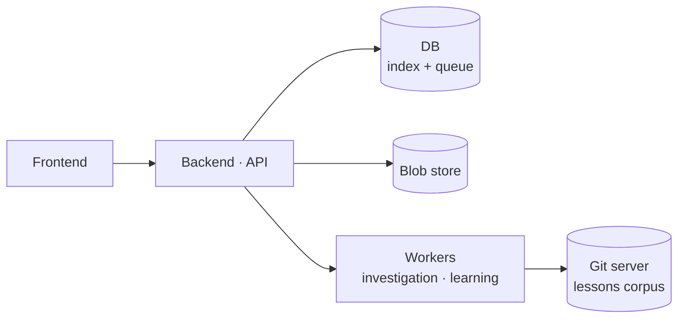
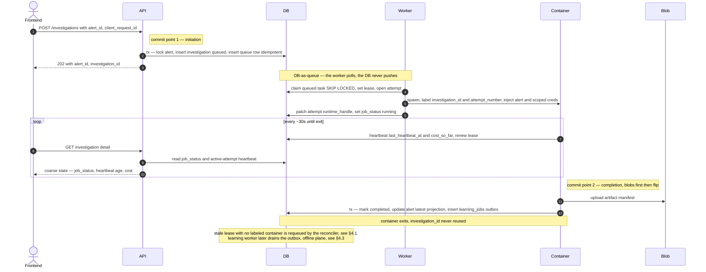
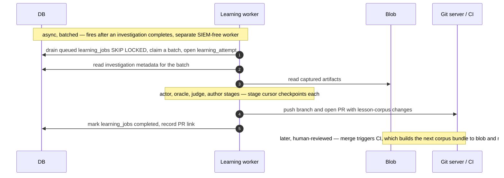

# Defender Platform Design

**Version:** 0.2 · **Status:** Draft — design record, not yet implemented · **Date:** June 2026

Design conclusions from scoping a production platform around the defender agent: turning today's dev
tooling (manual Python scripts that render local investigation-artifact directories) into a system with
APIs, a frontend, a real data layer, and per-investigation containers.

This is a **design record**, not an implementation plan — what we decided, _why_, and what is
deliberately deferred (§6). Where a section settles a build-it-this-way-not-that-way choice, the
rejected alternative and its graduation trigger are kept inline; that rationale is the point of the
document.

---

## 1. Requirements

### 1.1 Context

We operate _on top of_ a SIEM that owns the remote alerts. The platform is a thin control plane that
indexes those alerts, runs the defender agent against them in isolated containers, projects results
into a queryable store, and feeds completed runs into a separate learning loop. Defender is
**recommend-only** — it produces a disposition + confidence, it does not act (no `close_ticket`,
`block_ip`, …).

### 1.2 Functional requirements (surfaces)

| Surface                                                        | Nature                                                                                                                                               |
| -------------------------------------------------------------- | ---------------------------------------------------------------------------------------------------------------------------------------------------- |
| Investigate an alert / rerun (`POST /investigations`)          | **write** — start an execution for an existing local `alert_id` (required body field); a rerun is the same call on an alert whose investigations have all terminated |
| Live investigation view (`GET /investigations/:id`)            | **read (polling)** — job status + heartbeat at ~30s; artifacts after completion                                                                      |
| Alert history / incident review (`GET /alerts...`)             | **read** — DB index, latest-disposition projection, drill-down                                                                                       |
| Learning outcome + activity (`GET /learning-jobs`, `/lessons`) | **read** — corpora + activity feed                                                                                                                   |
| Re-learn (`POST /investigations/:id/learning-jobs`)            | **write** — fire another learning job                                                                                                                |

**The central reframe: most surfaces are reads over a DB index.** That framing holds cleanly for the
**lessons** reads (a producer-swap off the existing `serialize.py`), but **not** for
alert/investigation history, which has no current producer and is net-new (§2.1). The one thing that
genuinely changes the architecture is the **write path** (fire alert → investigation → container) —
that's where design energy belongs. The live view is intentionally coarse for v1: DB-backed polling of
lifecycle + heartbeat fields, not a token/tool stream.

Normal use is one SIEM alert → one local alert row → one investigation, and most alerts only ever have
one; an alert can accrue further investigations over time (after a bug fix, a lessons-corpus change, or
an environment change), but at most one is live at a time and the rest are sequential reruns through the
same endpoint (§3).

### 1.3 Non-functional requirements

- **Bias toward catching real threats over auto-closing** (inherited product posture): when uncertain,
  escalate rather than silently auto-close.
  > _Disclaimer: "zero false negatives" is a design bias, not an achievable guarantee. No triage system
  > eliminates false negatives, and treating literal zero as the target is counter-productive — it pushes
  > toward over-escalation and alert fatigue, which degrade the precision the product also needs. Read
  > this as "minimize false negatives, accept the precision cost knowingly," with the operating point
  > tunable per tenant rather than fixed at an unreachable absolute._
- **Scale target:** dozens–hundreds of investigations, each 5–15 min and a few dollars. Design choices
  (DB-as-queue, no Temporal, no separate broker) are calibrated to this scale and graduate explicitly
  when it changes (§6).
- **Tenant isolation from day one** — schema, blob keys, queue claims, and secret lookups all carry
  `tenant_id` even with a single initial tenant (§2.2, §4.7).
- **Reproducibility** — every investigation pins the exact defender image/SHA, model/prompt bundle, and
  lessons-corpus version it ran under (§2.8, §4.4).
- **Auditability** — every alert row, investigation, artifact read, investigation start, rerun confirm,
  learning re-run, cancellation, and credential change is a tenant-scoped audit event.
- **Crash-safety** — completion is a single commit point; orphaned containers and skipped learning are
  recovered by reconcilers, not by hope (§4.1).

### 1.4 Vocabulary

Use **alert** and **investigation** as the platform vocabulary. Do not expose the same upstream object
as "case" here, "notable event" there, and "incident" elsewhere.

- **Remote alert** — the SIEM/vendor object (alert, case, notable event, issue, incident). Normalize
  all of these to _alert_ at the boundary.
- **Alert** — our local, lean audit/projection row: owns `alert_id`, source-vendor identity, raw-alert
  pointer, timestamps, investigation list, and projected latest disposition.
- **Investigation** — one defender execution against an alert: owns job status, artifacts, cost,
  version pins, and the disposition/confidence it produced. (Its infra/runtime linkage lives in a
  separate attempts table — §2.2.)
- **Learning** — the offline, batch, SIEM-free plane that reads completed investigations and authors
  lesson-corpus changes through review. Distinct from the investigation plane (§3).
- **Learning job** — one unit of learning work bound to a completed investigation: owns its own
  lifecycle (`queued → running → completed | failed | skipped`) and a within-run `stage` cursor (§2.5).

The duplicate word "alert" at the remote/local boundary is acceptable (the boundary is narrow and
audit-oriented). Disambiguate with clear field names: `alert_id` (our PK), `source_vendor` (upstream
system), `remote_alert_id`/`vendor_alert_id` (upstream id), `raw_alert_json`/`raw_alert_blob_key`
(original payload).

### 1.5 Scope boundary

`POST /investigations` requires an existing local `alert_id` (a **required, validated body field**) and
does **not** resolve raw vendor payloads inline. Alert rows are upserted out of band by the source
adapter (or an explicit ingest step), keyed by `(tenant_id, source_vendor, remote_alert_id)` with
`remote_alert_id` **required**. The adapter returns the `alert_id`; the caller passes it to `POST
/investigations`. This keeps investigation creation a pure execution-creation step bound to an explicit
alert, and fixes the artifact↔alert binding: the investigation knows its `alert_id` from the request,
not from `report.md` (whose `case_id` is the run/investigation id, never the alert — §2.3).

Everything explicitly out of scope for the first build is collected with graduation triggers in §6.

---

## 2. Data model & API

### 2.1 Stores

- **DB = the index.** One row per alert, one per investigation; the alert-history API reads the DB,
  **not** a filesystem/blob walk. There is no investigation-history serializer today — the only
  existing serializer (`learning/frontend/serialize.py`) walks the _lesson corpora_ to emit
  `lessons.json`; nothing walks run directories for a run/disposition index. So this index is
  **net-new code, not a producer swap**. The naive port (glob the run prefix + 2 GETs per investigation
  per page) is exactly what fails at scale; the DB index exists to avoid it.
- **Blob = the payload.** Raw upstream alert JSON and heavy write-once artifacts (`report.md`,
  `investigation.md`, `tool_trace.jsonl`, `gather_raw/`, `runtime.html`, `lead_sequence.yaml`), fetched
  only when a specific alert or investigation is opened.

This splits the **three roles** a local artifact dir conflates today, onto different substrates:
an append-only **event log** (`tool_trace.jsonl`, `investigation.md`), an **artifact store**
(`runtime.html` ~1.2 MB, `transcript.html`, `gather_raw/`), and the **metadata source**
(`report.md` frontmatter, walked by `serialize.py`). V1 does **not** promote the event log to a
first-class durable stream — the container writes `tool_trace.jsonl` locally and uploads it at
completion; the live surface polls coarse DB state.

### 2.2 Schema

```
alerts(alert_id PK, tenant_id, source_vendor, remote_alert_id NOT NULL, signature_id, severity,
       title, description, created_at, changed_at, raw_alert_blob_key,
       latest_investigation_id, latest_disposition, latest_confidence, disposition_source,
       investigation_count, last_investigated_at, ...)

investigations(investigation_id PK, tenant_id, alert_id FK, investigation_counter, client_request_id,
       defender_version, lessons_corpus_version, job_status, disposition, confidence, cost,
       artifact_manifest, ...)

investigation_attempts(attempt_id PK, tenant_id, investigation_id FK, attempt_number,
       runtime_kind, runtime_handle, claimed_by, lease_expires_at, last_heartbeat_at, cost_so_far,
       started_at, finished_at, exit_status, ...)
```

**Field notes.**

- `alerts.source_vendor` — upstream system (Wazuh, Splunk, …); part of the upstream-identity key
  `(tenant_id, source_vendor, remote_alert_id)` and of the per-source secret path (§4.7).
- `alerts.created_at` / `alerts.changed_at` — the **upstream** alert's lifecycle timestamps (when the
  remote alert was raised and last modified), denormalized for display/sort. Distinct from our own row
  audit timestamps (folded into `...`).
- `alerts.description` — short denormalized display text, alongside `title`; loose SIEM-owned field.
- **Where the raw URLs are.** `raw_alert_blob_key` (and every key in `artifact_manifest`) is a
  **logical** blob key, not a stored URL. The actual raw/signed URL is **minted on demand at read time**
  by the artifact API (§2.9): `GET …/artifacts/:key` authorizes tenant access, then streams the blob or
  redirects to a short-lived signed URL. We don't persist signed URLs because they expire and aren't
  access-controlled on their own — the durable record is the key; the URL is derived per read.
- `alerts.latest_*` — the projection fields (§2.4): `latest_investigation_id`, `latest_disposition`,
  `latest_confidence`. They are derived, not authoritative; `disposition_source` records who set the
  current value (§2.4).
- `investigations.investigation_counter` — per-alert sequence number (1st, 2nd, … investigation of this
  alert), for display; not an idempotency key.
- `investigations.job_status` — the execution **lifecycle** (§2.3); the only progress axis the platform
  tracks. **There is no `phase` field** — within-run phase (ORIENT → … → REPORT) is inferred from
  `investigation.md` headers and that inference is currently fragile/unreliable, so the platform does not
  persist or expose it. The live view is heartbeat-based, not phase-based (§4.5). (If resume is ever
  built, phase boundaries are still the natural resumable points — but making that determination robust
  is part of that future work, §4.5/§6.)
- `investigations.artifact_manifest` — the set of logical artifact keys + sizes + content types +
  checksums uploaded at completion (§2.9). It records _which_ artifacts exist; URLs are resolved per read
  as above.
- `investigations.cost` — final cost, projected at completion; live `cost_so_far` lives on the active
  attempt.
- **`investigation_attempts` separates data from infra.** The durable audit row (`investigations`)
  carries no container identifier and no liveness fields. Each time a worker runs the investigation it
  opens an _attempt_ row holding everything infra/runtime: `runtime_kind` (docker / k8s-job / fargate),
  an opaque `runtime_handle` for that substrate, the claim/lease + liveness (`claimed_by`,
  `lease_expires_at`, `last_heartbeat_at`, `cost_so_far`), and the attempt's outcome. We do **not** rely
  on container ids being globally or temporally unique — the reconciler matches containers to attempts by
  a label it sets to `(investigation_id, attempt_number)` (§4.1), so a reused or substrate-local handle
  is harmless. There is no separate `claim_count`: `attempt_number` already counts the runs. Today an
  investigation has exactly one attempt (terminal ids are never reused — retry means a new
  investigation); when durability graduates (§6), crash-and-resume becomes additional attempt rows under
  the same `investigation_id` without touching the data row.

**One alert → many investigations**, but normal use expects one live investigation at a time, and most
alerts only ever have one. Additional investigations arise from: full retry after infra failure; manual
rerun after a bug fix, a lessons-corpus change, or a SIEM backfill. They are sequential reruns through
`POST /investigations`, never a separate class of execution. (Eval-style workflows — model A/B, prompt
eval, held-out comparison — are out of scope for the MVP platform; §6.)

**The alert table is a thin index, not a system-of-record.** We operate _on top of_ a SIEM that owns
the remote alerts, so the alert row is a local projection: our PK, the source identity, just enough
denormalized display fields to list/filter without round-tripping the SIEM (signature, severity, title,
description, created_at), a raw-payload pointer, and our derived state (disposition projection,
investigation count, last_investigated_at). Be **loose** on SIEM-owned fields (snapshot the full `alert.json` to blob, don't
validate it), **strict** on our fields (tenant scoping, FK, state machine, projections). Do not mirror
the full alert into columns — that drifts toward the e2e platform we are not.

**Tenant scope is part of the key space from day one.** Even with one tenant initially, the schema,
blob keys, queue claims, and secret lookups carry `tenant_id`: upstream-identity uniqueness is
tenant-scoped, all reads filter by tenant, blob paths live under a tenant prefix, and per-job SIEM
credentials are fetched from a secret-manager path scoped by `(tenant_id, source_vendor)`. Avoids later
re-keying of the core audit tables.

### 2.3 Job status vs. disposition

Two different axes; keep them distinct.

- **`job_status`** — the investigation **execution lifecycle** in the DB (table below). This is the
  state machine the platform owns, replacing the dev-era FS-presence heuristic (a dir with `alert.json`
  but no `report.md` = aborted). "Job" deliberately: it describes the _run_, not where the agent is
  inside the run. (There is no separate within-run `phase` axis — §2.2: inferring it is fragile, so the
  platform tracks only `job_status` + heartbeat.)
- **`disposition`** — the investigation _outcome_ (below).

`job_status` values:

| `job_status`  | Meaning                                                                                                                                                                                                                                                                                                                      |
| ------------- | ---------------------------------------------------------------------------------------------------------------------------------------------------------------------------------------------------------------------------------------------------------------------------------------------------------------------------- |
| `queued`      | Row + queue item exist; no container started.                                                                                                                                                                                                                                                                                |
| `running`     | A container owns the investigation and should be heartbeating.                                                                                                                                                                                                                                                               |
| `completed`   | Terminal success: required blobs uploaded, frontmatter parsed, metadata committed.                                                                                                                                                                                                                                           |
| `unparseable` | Terminal: container exited and uploaded artifacts, but `report.md` frontmatter failed to parse (bad YAML / bad `disposition` enum). The agent ran to completion but produced no projectable disposition — stored with null disposition + parse-error note. **Blocks learning**; only recovery is a fresh investigation (§4.6). |
| `failed`      | Terminal infra/runtime failure; retry may create a new investigation.                                                                                                                                                                                                                                                        |
| `aborted`     | Terminal intentional stop/cancel, timeout-policy stop, or superseded investigation.                                                                                                                                                                                                                                          |

**`disposition`** (`malicious` / `benign` / `inconclusive`) is the investigation **outcome**.
Empirically, defender's `report.md` frontmatter is exactly `{case_id, disposition, confidence}` —
free-form YAML with **no write-time validation**, parsed post-hoc by `_loop_validate._parse_frontmatter`
(`disposition` enum checked in `normalize_disposition`). (soc-agent's frontmatter is a richer ~11-field
schema; this platform targets defender, so the lean 3-field shape is the one to project.) In the normal
runtime path `case_id` is the run directory name — effectively the **investigation id**, not the remote
alert id; some replay/eval paths restamp it as a stable seed. Project normal-runtime `case_id` →
`investigation_id`; on replay/eval paths preserve it as `legacy_case_id`/`source_case_id` and mint a
real platform `investigation_id`.

### 2.4 Disposition projection

An alert's **`latest_disposition` is a projection** from completed investigations, not an overwritten
field. Projection rule: **human-set override first, then the latest completed investigation** (excluding
`unparseable`, which has no projectable disposition — §4.6). Latest, not highest-confidence: confidence
isn't comparable across model/prompt versions and makes stale results sticky, and since reruns happen
_because_ code, lessons, or environment changed, the newer completed investigation is the more
trustworthy one.

**What `disposition_source` is for.** It is the one field that lets auto-projection coexist with human
overrides: it records whether the alert's current disposition came from the projection (`auto`) or a
human (`human`, with `disposition_set_by` / `disposition_set_at` / `disposition_reason`). Auto-projection
overwrites the alert **only when `disposition_source = auto`** — a human verdict is sticky and is never
clobbered by a later auto-run. Without it, the projector couldn't tell "stale auto value, safe to
refresh" from "human said benign, leave it alone." We keep it to two values; the earlier
`human_pinned` / `human_manual` split (override-an-investigation vs. type-a-value) was speculative —
add it only if a consumer needs to distinguish them.

The incident-review screen shows **one row per alert, investigation history on drill-down** — mirroring
SIEM incident review (one upstream alert, many analyst/agent touches), not one row per investigation.

There is no analyst-facing _resolution_ state in v1. If the product later needs `open` / `acknowledged`
/ `closed` / `suppressed`, add it as `alerts.review_status` (with reviewer/timestamp), kept distinct
from investigation lifecycle and disposition (§6).

### 2.5 `learning_jobs` table (also the completion outbox)

Learning jobs have their **own** lifecycle (`status: queued → running → completed | failed | skipped`,
with a `stage` cursor — §4.3). It is a separate field from the investigation's `job_status`; never
overload one onto the other.

In the same transaction that marks an investigation `completed`, insert a `learning_jobs` row
(`status=queued`, `ON CONFLICT DO NOTHING`). The table **is** the outbox — no separate outbox table.
A worker drains queued rows; a reconciler backfills any `completed` investigation lacking an auto job,
so a crash after completion can't silently skip learning. `unparseable` investigations are excluded (no
projectable disposition).

Learning gets the **same data/infra split as investigations** (§2.2): a durable `learning_jobs` data
row carrying lifecycle + checkpoint, and a `learning_attempts` table carrying everything infra/runtime.

```
learning_jobs(
  learning_job_id  PK,
  tenant_id,                              -- matches the investigation's tenant
  alert_id         FK → alerts,           -- denormalized: "all learning activity for this alert"
  investigation_id FK → investigations,   -- the source execution
  client_request_id nullable,             -- NULL = auto (outbox/reconciler); set = explicit re-learn
  status           queued | running | completed | failed | skipped,
  stage            nullable,              -- durable checkpoint: actor | oracle | judge | author
  status_detail    nullable,              -- one free-text field: skip reason or error summary
  created_at, finished_at, ...
)

learning_attempts(attempt_id PK, tenant_id, learning_job_id FK, attempt_number,
  runtime_kind, runtime_handle, claimed_by, lease_expires_at, last_heartbeat_at,
  learning_batch_id,                      -- the batch run that processed this attempt
  started_at, finished_at, exit_status, ...)
```

- **Symmetric with `investigation_attempts`.** The job row is durable data (who/why/where-it-got-to);
  the attempt row is one worker run with its `runtime_handle`, claim/lease/liveness, and `learning_batch_id`.
  Crash-and-resume = a new attempt under the same `learning_job_id`, picking up from the job's `stage`.
- **`stage` stays on the job, not the attempt** — it is the durable checkpoint that survives across
  attempts, so a mid-`author` crash resumes at a stage boundary instead of re-running an expensive
  earlier stage. (Unlike investigation `phase`, the stage boundary is a real orchestrator seam between
  LLM calls, so it is reliable to record — §4.3.)
- **No `reason` column — it's derivable.** Auto vs. explicit re-learn is exactly `client_request_id IS
  NULL` vs. set, so a separate `reason` enum would just be a denormalized duplicate. The GET endpoints
  derive the label from `client_request_id` (§2.6).
- **Auto creation is deduped; explicit re-learn is not.** Re-learning is cheap and unlimited. The only
  thing the schema must prevent is the _automatic_ path double-firing (the `investigation.completed`
  insert racing the reconciler backfill). Partial unique index scoped to auto jobs:
  `UNIQUE (investigation_id) WHERE client_request_id IS NULL AND status IN ('queued','running','completed','skipped')`.
  Explicit re-learns carry a `client_request_id`, sit outside that index, dedupe by
  `UNIQUE (tenant_id, client_request_id)`, and coexist as additional rows.
- **One `status_detail`, not two.** A `skipped` job and a `failed` job both just need a short
  human-readable note; separate `skip_reason` / `error_summary` columns were redundant. A `skipped` job
  is a terminal record, not a lock — re-learning is just another explicit job (no `superseded` status,
  no `base_learning_job_id`, no audited-override ceremony). The one hard block is `unparseable` (§4.6).
- **Where the URLs are.** The resulting `lessons_corpus_version` resolves to a corpus bundle in blob via
  the artifact layer, and the PR link is a real external GitHub URL — both surfaced on the detail
  endpoint (§2.6) at read time, neither stored as a durable URL on the row.

### 2.6 API surface

Frontend reads + a small write path (all tenant-scoped).

**Writes are flat; lists nest.** Both `investigation` and `learning_job` have their own global ids and
entirely flat canonical reads (`/investigations/:id`, `/learning-jobs/:id`), so creation is a flat
top-level verb with the parent supplied as a **required body field** — the Stripe-style resource shape,
and the same rule for both resources (no asymmetry: investigation-create is not nested under alert, so
learning-job-create is not nested under investigation either). Parent-scoped **list** reads stay nested
because a sub-collection genuinely belongs to its parent; that read/write split is standard convention,
not the asymmetry §2 set out to remove.

```
GET  /alerts, /alerts/:id                     alert history / review
GET  /alerts/:id/investigations               execution history for one alert (sub-collection)
GET  /alerts/:id/learning-jobs                all learning activity for an alert (via denormalized alert_id)
GET  /lessons, /loop, /learning-jobs          learning reads + activity feed
POST /investigations          { alert_id, client_request_id }          start/rerun for an alert_id
GET  /investigations/:id                       poll job status + heartbeat (~30s); coarse DB state only (§4.5)
GET  /investigations/:id/learning-jobs        all jobs for an investigation (auto + re-learns), newest first
GET  /investigations/:id/artifacts/:key       authorized, audited artifact read (§2.9)
POST /learning-jobs           { investigation_id, client_request_id }  fire an explicit re-learn
GET  /learning-jobs/:id                        detail: status, stage, timestamps, status_detail, resulting corpus version + PR link
```

**A rerun is not a separate verb.** `POST /investigations` for an alert whose investigations have all
terminated _is_ the rerun — the UI button can say "rerun" while the API stays a single
"create-an-execution" verb keyed on `alert_id` (§4.1 covers the live/terminal gating). Alert list/detail
key off `alert_id`; polling, artifacts, and logs key off `investigation_id`.

`POST /learning-jobs` carries `investigation_id` + a `client_request_id`, and returns the existing live
job for that request id. Refused only when the investigation is `unparseable`; a prior
`skipped`/`completed` job does not block it. A human-fired re-learn is an `investigate` action and a
tenant-scoped audit event. The auto vs. explicit-re-learn label on read is derived from
`client_request_id` (§2.5), not a stored `reason`.

### 2.7 Vendor alert normalization envelope

Require a thin normalized envelope, keep the raw payload in blob. Required: `tenant_id`, `source_vendor`,
`remote_alert_id`, raw-payload blob key, display title, display `created_at` (upstream first-seen),
severity when available, source rule/signature when available. Optional adapter fields: `remote_url`,
`description`, entity anchors, upstream `changed_at`, vendor case/incident labels. **Strict on the
envelope, loose on the raw payload.** A source that can't supply a stable upstream id must mint one in
its adapter before calling the platform — the platform does not fingerprint arbitrary alert JSON (fuzzy
grouping is deferred, §6).

### 2.8 Version provenance

Human release names are convenience labels, not reproducibility anchors. Each investigation stores
immutable pins: `defender_image_digest`, `defender_git_sha`, optional `defender_release_channel`, and
the resolved model/prompt-bundle id if it varies independently of the image. `lessons_corpus_version`
is CI-minted (§4.4), never hand-incremented.

### 2.9 Artifact link resolution

API-authorized reads are the product contract. The DB artifact manifest stores logical keys, sizes,
content types, checksums — **not** durable raw blob URLs.
`GET /investigations/:id/artifacts/:artifact_key` authorizes tenant access, audits the read, and
streams the blob or redirects to a short-lived signed URL (implementation detail). `runtime.html` and
friends are served/rewritten so relative links resolve through that API path.

### 2.10 Auth / RBAC

Use tenant identities, enforce authorization at the API boundary; no separate internal user-auth
system. Coarse roles: `read` (view alerts/investigations/dispositions/artifacts), `investigate` (also
fire investigations and confirmed reruns), `write` (administer tenant/source bindings + credentials).
Internal workers use service identity. All artifact reads, investigation starts, rerun confirms,
learning re-runs, cancellations, and credential-binding changes are tenant-scoped audit events.

---

## 3. High-level design

**The gist.** A frontend talks to a backend; the backend owns the stores and dispatches work to
containerised workers. Everything else (planes, reconciler, secret manager, the `ContainerRunner` seam)
is detail that belongs in the deep dives — the interesting part is the investigation **write path**,
which gets its own sequence diagram below.



The two **workers** are the online investigation worker (per-alert, holds scoped SIEM creds) and the
offline learning worker (batch, SIEM-free); they share the substrate but not privileges (§4.3). The
endpoint surface is §2.6; the component-level wiring (reconciler, adapter, secret manager, SIEM) is
drawn out where it matters in §4.

**Two dependent lifecycles, not one.** The system is an online-serving plane (investigations) and an
offline-batch plane (learning), joined by a single seam: an investigation's `completed` transition
(§4.3).

- **Investigation** — production-facing serving execution: starts from an alert, holds SIEM/ticketing
  creds, gathers evidence, writes artifacts, terminates `completed | failed | aborted | unparseable`.
- **Learning** — downstream batch execution: starts _only_ after `completed`, reads captured artifacts,
  writes lesson-corpus changes through review. Its failure must never roll back or threaten the
  completed investigation.

**Write path lifecycle.** `POST /investigations` is an **async job, not a synchronous `run.py`.** It
takes an existing `alert_id`, creates the investigation when needed (`job_status=queued`), enqueues, and
returns `{alert_id, investigation_id}` immediately. A worker spawns a per-investigation container; the
container heartbeats coarse progress and on exit uploads artifacts + flips the row to `completed` (or
`unparseable`). Reads of alerts/investigations/learning are a DB index over what the system already
produces; the hard engineering is reserved for this write path.

**Investigation write path.** The ordered request sequence for one investigation — the genuinely
sequential flow (reads are trivial, so omitted). The two commit points (§4.1) and the poll loop are
called out inline; the trailing `learning_jobs` outbox row is the seam into learning, drawn next.



**Completion is the commit point.** A local dir is atomically "there"; blob + DB is a two-phase write.
Resolve by making **the investigation row the completion commit point**: upload blobs first, flip the
row last, so a `completed` investigation always has its required artifact manifest. Update the alert's
latest-disposition projection in the _same_ transaction when the rule selects that investigation. GC
orphaned blobs from investigations that died before committing. `lead_sequence.yaml` is cheap, drives
`runtime.html`, and is required by the learning loop — include it in the completion manifest, not as an
optional side effect.

**Learning write path.** The second half of the write story, across the seam: the `learning_jobs` outbox
row inserted above is drained by the offline, SIEM-free learning worker, which authors lesson-corpus
changes and pushes them to the **git server** through review (§4.3, §4.4). It is async and batched — it
does not block or roll back the completed investigation.



**Container substrate stays neutral behind a `ContainerRunner` interface.** First impl can be
worker-invoked `docker run` on a single host, but against the same contract a production runner needs:
label/handle by `investigation_id`, resource limits, scoped secret injection, heartbeat,
list/adopt/kill for the reconciler, artifact upload on exit. Moving to Kubernetes Jobs / Fargate later
implements the same runner without touching APIs or schemas.

---

## 4. Deep dives

### 4.1 Durability & crash-safety

**Two commit points, don't confuse them.** At _initiation_: investigation row first → open an
`investigation_attempts` row → spawn the container labeled with `(investigation_id, attempt_number)`
(the investigation row is the durable record of intent, must exist before any side-effect; infra
linkage lives on the attempt, not the data row — §2.2). At _completion_: blobs first → flip the row. The
investigation row exists throughout; what moves is `job_status`.

**Idempotency, enforced in the DAL _and_ by DB constraints** — not just API convention. Investigation
idempotency is keyed by the **local `alert_id`**. Constraints: `alerts(tenant_id, source_vendor,
remote_alert_id)` unique; a partial unique index allowing at most one live (`queued`/`running`)
investigation per `(tenant_id, alert_id)`; queue table unique on `investigation_id`. The DAL method is a
single `create_investigation_for_alert(alert)` transaction:

1. load + lock the alert row (`SELECT ... FOR UPDATE`);
2. if a live (`queued`/`running`) investigation already exists, return it — concurrent submits and
   double-clicks collapse onto the same row (the partial unique index makes this a hard guarantee, not
   just a check);
3. otherwise insert the investigation row;
4. insert the queue row keyed by `investigation_id` (`ON CONFLICT DO NOTHING`);
5. return `{alert_id, investigation_id}`.

The gate on starting _another_ investigation depends on what already terminated:

- **a live investigation exists** → blocked; the call returns the existing one (step 2).
- **only `failed`/`aborted` priors** → a fresh investigation starts with no friction; nothing produced
  a result worth second-guessing.
- **a `completed` investigation exists** → allowed, but the UI requires an explicit "start another
  investigation?" confirm first — a UI affordance and a tenant-scoped audit event, not a server-side
  approval ceremony.

A `client_request_id` (unique per `(tenant_id, alert_id)`) carried on the request dedupes retries and
double-clicks so they don't fork.

**Crash-safety from idempotency + a reconciler.** Pattern: database-as-queue + state machine. The
classic failure ("spawned, died before recording the runtime handle → orphan") is handled by
**labeling the container with `(investigation_id, attempt_number)`** rather than trusting a handle the
row may never have captured — a periodic reconciler lists containers by label, matches them to attempt
rows, and kills/adopts/retries mismatches. This is also why the attempt's `runtime_handle` need not be
globally or temporally unique (§2.2): the label is the source of truth, not the substrate's id.

**Worker leases, not long transactions.** `SELECT … FOR UPDATE SKIP LOCKED` claims a queued task, sets
`claimed_by` / `lease_expires_at`, commits. The worker must not hold a transaction while a 5–15 min
container runs. **Liveness is owned by the container's heartbeat**: the container holds scoped DB creds
for its own attempt row and renews the lease by heartbeating `last_heartbeat_at` / `cost_so_far` on the
attempt (§4.5). A stale `last_heartbeat_at` with no matching labeled container is requeueable while
non-terminal.

> **Requeue is unconditionally safe here: defender is recommend-only.** There are no `act` verbs
> (`close_ticket`, `block_ip`, …), so an investigation has no external side-effect to double-apply on
> requeue. _If act-mode is ever graduated, requeue safety must be revisited — a partially-acted
> investigation is no longer freely re-runnable._

After a container has run and reached a terminal state (`completed` / `failed` / `aborted`), that
`investigation_id` is never reused; retry means a new investigation via `POST /investigations`. (A claim
failure _before_ container spawn keeps the same investigation_id — release the lease and let another
worker claim, opening a fresh attempt; `attempt_number` counts the runs.)

**Don't reach for a durable-execution engine (Temporal) yet.** A task table + status column +
reconciler cron is right at this scale. Graduate when orchestration grows multi-step
retries/timeouts/human-in-loop — which surfaces first in the learning loop (§4.3), not here (§6).

### 4.2 Queue storage

**Keep the queue in the DB.** At this scale (dozens–hundreds of investigations, 5–15 min each),
separating it (SQS/Kafka/Rabbit) is premature and _introduces_ the dual-write consistency problem.
DB-as-queue gives **transactional enqueue** for free — the same transaction that writes the
alert/investigation row enqueues the job. The mechanism is Postgres `SELECT … FOR UPDATE SKIP LOCKED`
for short claim transactions, then lease/heartbeat renewal while the container runs. Separate only on a
real throughput / fan-out / independent-scaling reason — not yet (§6).

### 4.3 Investigation ↔ learning seam

**Learning does not continue inside the investigation container.** The seam is an investigation's
`completed` transition; learning runs in a **separate, ephemeral, batch, SIEM-free worker** — the
standard online-serving (investigation) vs. offline-batch-training (learning) split.

**Why they must not share a container:**

1. **Privilege separation.** Investigation holds live SIEM creds + network; the whole learning plane is
   **SIEM-free** (even the actor writes its counterfactual from the completed investigation, not a live
   query). Fusing them would run learning with creds it shouldn't hold and force the investigation image
   to carry git/PR tooling.
2. **Scope.** Learning is frequently cross-investigation (consolidation, held-out eval, dedup); a
   per-investigation container only has its own context.
3. **Failure coupling.** Investigation is 5–15 min; learning is a longer, bursty LLM chain (actor →
   oracle → judge → author). A learning crash must not threaten an already-successful investigation.
4. **Independent throttling.** Learning is expensive and not urgent → batch it; investigations are
   urgent.
5. **Replayable seam.** `investigation.completed → learning job` lets you re-learn from a past
   investigation without re-running defender (already supported via `learning/replay_actor.py`).

The learning plane is **tenant-scoped to start**: a job reads only its own tenant's artifacts, batches
drain one tenant at a time, the corpus is per-tenant (§4.4). A single global cross-tenant corpus is a
deferred decision gated on a redaction/isolation review (§6).

**Learning worker tools:** blob read · corpus read+write · git/PR creds · LLM API · MITRE/oracle/
ground-truth read · DB (investigation-metadata read, `learning_jobs` write, lesson-index write).
**Not:** SIEM/MCP, ticketing, host access.

**Operational cutover.** The dev CLI may keep its "run investigation, then run learning" default; the
platform worker invokes the harness in a no-learning mode (`run.py --no-learn` or equivalent), commits
the investigation first, then creates the learning job. `investigation.completed` must never wait for,
or be rolled back by, the learning loop. Host learning as **event-/cron-triggered ephemeral jobs that
batch-drain completed investigations** (amortizes cold start), not an always-on service.

**Batch processing is a claim pattern, not a second entity.** A cron/event worker claims N queued rows
(`… SKIP LOCKED LIMIT N`), optionally stamps a shared `learning_batch_id`, runs the cross-investigation
loop (consolidation / dedup / authoring) once, marks each row `completed | skipped`. The corpus-version
bump is recorded on the corpus, not per row. Per-stage checkpointing (the `stage` cursor) pays for
itself — each stage is its own expensive non-deterministic LLM call, so a mid-`author` crash resumes at
a stage boundary. **Do not** build a micro-stage DAG orchestrator — extend the investigation/job
substrate (the existing on-disk `_pending/*.jsonl` queues move onto it), don't invent a second one.

**MVP trigger policy:** every completed investigation creates one auto job and fires the loop. Failed /
aborted / `unparseable` don't trigger. Keep policy a **replaceable module**, not `if`s scattered in
completion handling — a `learning_policy` table/endpoint (sampling, only-on-disagreement,
sparse-coverage priority, tenant overrides) is deferred (§6).

### 4.4 Lessons corpus across concurrent containers

The key correction: **investigation containers READ lessons; they do not WRITE them.** The agent
consumes lessons via retrieval during an investigation; the learning loop authors them separately,
afterward. So the model is **many concurrent readers, one serialized writer** — _not_ "every
investigation opens a PR." Split into two planes:

- **Read/serve plane (containers): a pinned, versioned blob snapshot.** Containers consume an immutable
  "lessons corpus vN" bundle — they do **not** `git clone` to read. Each investigation **pins the
  version it used**, making verdicts reproducible. Bundles are **per-tenant** for MVP;
  `lessons_corpus_version` is keyed by `tenant_id`, and a container pins its own tenant's latest
  published bundle at start and does not hot-swap mid-run. A critical lesson is handled by priority-
  publishing a new bundle for subsequent investigations; in-flight ones can be cancelled/rerun.
- **Write/review plane (learning loop): branch + PR on the existing host.** Today the curator
  (`author.py`) is local-git only (`add`/`commit`/`checkout`, no push); a sibling path
  (`lead_author.py:901`) already has a gated, branch-safe `maybe_push` (`LEAD_AUTHOR_PUSH=1`, refuses
  `origin/main`/`master`), but **no `gh pr create` exists anywhere** in the loop. The platform reuses
  that branch-safe push machinery and adds only `gh pr create` on top of the structured commit the
  curator already lands — a thin addition. Merge triggers CI that builds **corpus vN+1** to blob.
  `lessons_corpus_version` is **minted by CI**, never hand-incremented.

Conflicts/staleness mostly evaporate: the writer is serialized, and indices are **regenerated from the
directory, never hand-merged** (the `MEMORY.md` / `board.html` pattern); some corpora fold/stale/delete
superseded mutable facts, so don't rely on pure append-only semantics. An investigation pinned to vN
keeps using vN even if vN+1 publishes mid-run — that's correct (reproducibility), not a bug.

**No self-hosted git.** Authoring is low-frequency expensive LLM work; the curator already commits
locally, so `push` + `gh pr` against GitHub is a thin extension. Self-host only for compliance isolation
or high-frequency programmatic commits — neither applies (§6).

### 4.5 Persistence granularity & live view

Four things persist with different needs — one answer per layer, not a single "per-tool vs.
per-completion" choice:

| Layer                 | Granularity                    | Mechanism                                                                                                                           |
| --------------------- | ------------------------------ | ----------------------------------------------------------------------------------------------------------------------------------- |
| **Progress metadata** | ~30s heartbeat                 | update the active attempt row (`last_heartbeat_at`, optional `cost_so_far`) + `job_status` on the investigation. Powers the polling view. |
| **DB metadata row**   | lifecycle checkpoints          | write on state transitions (`queued→running`, terminal). Per-tool writes here are pure churn.                                       |
| **Trace artifact**    | local per tool, uploaded once  | `tool_trace.jsonl` stays the append-only local trace; upload to blob at completion. No per-event S3 PUT, no streaming sink for MVP. |
| **Bulk artifacts**    | once, at completion            | build/project `runtime.html`, `lead_sequence.yaml`, etc.; PUT as the `→completed` commit (blobs first, then flip the row).          |

**Polling-first live view.** Users don't need every token/tool event. The detail endpoint exposes
coarse DB state only: `job_status`, `queued_at`, `started_at`, `finished_at`, `last_heartbeat_at`
(from the active attempt), server-computed heartbeat age, elapsed, `cost_so_far` when available,
optional token/tool counts, `status_detail`, and artifact availability. **No within-run `phase`** — it
is fragile to infer reliably, so the live view is heartbeat-based, not phase-based (§2.2). The artifact
manifest appears only after completion (no `last_artifact_checkpoint` — artifacts are committed at
completion, not continuously).

**Checkpoint granularity is bounded by a hard constraint: you cannot checkpoint mid-LLM-call.** The
only resumable points are where control returns to the orchestrator — the phase boundaries
(ORIENT → PLAN → GATHER → ANALYZE → REPORT) marked by headers in `investigation.md`, ~5 per
investigation. The platform does not _track_ live phase (above), but those headers still exist in the
artifact, so if resume is ever built (§6) they are the natural resume points — robustly determining the
current one is part of that future work.

**Defer resume and streaming.** For 5–15 min, few-dollar investigations, resume-from-checkpoint is
over-engineering — on crash, spawn a fresh investigation (alert → many investigations supports this).
Build resume only when economics change (§6): investigation p95 wall time > 30 min, p95 cost ~1 order of
magnitude over today, preemption wastes more than low-single-digit % of budget, or a customer needs
long-running investigations — and even then, resume only at phase boundaries. Per-event streaming
(SSE/WS token/tool tail) is neither a product nor a durability requirement for MVP; add a streaming sink
_then_, not as a prerequisite.

### 4.6 Unified data layer: file interface + projection

There is **no single store that is natively both ACID-structured and natural-text-blob.** The answer is
a **file interface over polyglot persistence, with a projection seam we already have.**

- **Keep the file interface as the agent contract.** Agents are post-trained hard on
  read/write/edit/grep; a bespoke `db.insert()` tool fights that prior and degrades behavior. Decouple
  _interface_ (files) from _storage_ — the read/write tool can back onto blob/DB/fs transparently. One
  cost: a shim must honor the POSIX semantics the agent assumes (read-after-write, atomic-ish rename).
- **Storage options that get close:** Postgres + JSONB/TEXT + blob pointers (boring correct default);
  SQLite-per-investigation (ACID _and_ a single file — the `.sqlite` becomes a blob artifact); Dolt
  (git-semantics + SQL ACID, the closest literal answer but niche).
- **The synthesis is a projection step, not a magic store.** The agent writes plain files; a
  **projector** extracts structured fields → DB (ACID index for history/filtering/projection) and
  uploads bulk → blob.

**Validation altitude differs by agent — the platform must not assume soc-agent's.** soc-agent
validates its structured block _at write time_ (invlang PreToolUse hooks), so its projector reads
already-validated fields. **defender deliberately has no write-time report validation** (CLAUDE.md puts
runtime gates out of scope), so the projector is **post-hoc parsing** of unvalidated frontmatter —
exactly today's `_loop_validate._parse_frontmatter` / `normalize_disposition`, lifted to also write
Postgres. Adding a write-time hook would be net-new and against defender's philosophy.

Because the parse is post-hoc and unguarded, it _can_ raise on an investigation whose container exited
cleanly. That is **not** an infra `failed` — the agent ran to completion. The completion path commits it
as **`unparseable`** (§2.3): null disposition, parse-error note, artifacts uploaded for debugging, and
**no** learning job. This is the defined terminal state for a successful-but-unprojectable run — a real
case the "no write-time validation" choice makes concrete rather than hypothetical.

**Skip a FUSE-style shim for MVP.** Run the agent on a real ephemeral filesystem, keep the existing
file-writing contract + validation hooks, then project structured fields into Postgres and upload
artifacts to blob at completion. Build a shim only if a future requirement needs live storage
virtualization or multi-host artifact mutation mid-investigation (§6); otherwise the POSIX-semantics
risk isn't worth carrying.

### 4.7 Security

- **Tenant isolation is structural, not a filter bolted on later.** `tenant_id` is in the key space of
  every audit table, blob prefix, queue claim, and secret path from day one (§2.2). All reads filter by
  tenant; the learning plane reads only its own tenant's artifacts (§4.3).
- **Per-job scoped, short-lived SIEM/MCP credentials** from a secret manager (path scoped by
  `(tenant_id, source_vendor)`), not a baked-in shared `.env`. The container holds creds only for its own row.
- **Privilege separation across planes.** The investigation plane holds live SIEM creds + network; the
  learning plane is **SIEM-free** and holds git/PR + LLM creds only (§4.3).
- **Prompt-injection defenses still apply.** Existing salted-delimiter tagging of untrusted content
  carries over — the per-investigation container isolates blast radius, it doesn't replace those
  defenses.
- **Auth at the boundary, audit everywhere.** Authorization is enforced at the API boundary with coarse
  tenant roles (§2.10); artifact reads, investigation starts, rerun confirms, learning re-runs,
  cancellations, and credential-binding changes are all tenant-scoped audit events.

### 4.8 Scalability

- **Concurrency cap / backpressure** — containers cost money and share an Anthropic rate limit, so the
  worker pool is capped and queued work backs up in the DB queue rather than over-spawning.
- **DB-as-queue is the deliberate scale choice** for dozens–hundreds of 5–15 min investigations (§4.2);
  a separate broker is the graduation path on real throughput / fan-out / independent-scaling need (§6).
- **Container substrate is swappable** behind `ContainerRunner` — single-host `docker run` →
  Kubernetes Jobs / Fargate without touching APIs or schemas (§3).
- **Reads scale off the DB index, not blob walks** — the whole point of §2.1 is to avoid the
  glob-the-prefix + N GETs-per-page pattern that fails at scale.
- **Learning is batched and off the urgent path** — amortizes cold start and throttles expensive LLM
  chains independently of investigations (§4.3).

---

## 5. Current implementation & migration draft

### 5.1 What exists today

Dev tooling: manual Python scripts that render local investigation-artifact directories. Load-bearing
pieces the platform reuses rather than rewrites:

- `learning/frontend/serialize.py` — walks the _lesson corpora_ to emit `lessons.json`. The only
  existing serializer; powers the cheap learning-outcome read (producer swap). **No** equivalent walks
  run directories for an alert/investigation index — that index is net-new.
- `_loop_validate._parse_frontmatter` / `normalize_disposition` — post-hoc parse of defender's
  `{case_id, disposition, confidence}` frontmatter. Becomes the projector (lift to also write Postgres).
- `author.py` — curator, local-git only (`add`/`commit`/`checkout`, no push).
- `lead_author.py:901` — gated, branch-safe `maybe_push` (`LEAD_AUTHOR_PUSH=1`, refuses
  `origin/main`/`master`). No `gh pr create` anywhere yet.
- `learning/replay_actor.py` — already supports re-learning from a past investigation without re-running
  defender (the replayable seam).
- On-disk `_pending/*.jsonl` queues — move onto the DB job substrate, don't invent a second one.

### 5.2 Phasing

1. **Index first; split the platform completion point.** Add alert + investigation rows and blob upload
   as a side-effect of the existing harness, invoked with learning disabled: commit
   `investigation.completed`, then create the learning job. The dev CLI keeps its current default while
   the platform path moves to the two-lifecycle model. Read surfaces ship before container work — but
   only the **learning-outcome** read is a cheap producer-swap off `serialize.py`; the
   **alert/investigation history** read is net-new, gated on the projector + §2 schema landing first.
2. **Async write path + polling progress.** Move `run.py` behind a task table + worker +
   per-investigation container. `POST /investigations` returns `{alert_id, investigation_id}`; the
   frontend polls job status + heartbeat every ~30s.
3. **Optional live tail later.** Add SSE/WS only if users actually need token/tool-level tailing —
   off the MVP critical path (§6).

**The trap to avoid:** treating all surfaces as equally novel and building streaming-first.
Alert/investigation history and learning are a DB index over what we already produce — ship them on the
existing contract and reserve the hard engineering for the write path.

### 5.3 Tech choice

**Stay in Python / FastAPI.** It reuses the existing Python that already shapes these payloads
(`serialize.py` for lessons, `_loop_validate.py` for dispositions), serves simple polling endpoints,
and matches the `playground_ticket_cli.py` precedent. A bun/TS gateway would force re-implementing the
artifact→contract transform in another language for no benefit. Bun earns its keep only if the frontend
grows into a real SPA — not yet justified.

---

## 6. Deferred (with graduation triggers)

Explicitly out of scope for the first platform build. If a later constraint changes one, record it as a
new decision rather than re-opening the core API/schema.

| Deferred                                                                | Graduate when                                                                                                                                          |
| ----------------------------------------------------------------------- | ------------------------------------------------------------------------------------------------------------------------------------------------------ |
| Token/tool-level live tail (SSE/WS streaming sink)                      | a product need requires live tailing (§4.5, §5.2)                                                                                                      |
| Checkpoint-resume                                                       | p95 wall > 30 min, p95 cost ~10× today, preemption wastes >low-single-digit % of budget, or a customer needs long-running investigations (§4.5)        |
| Durable-execution engine (Temporal)                                     | orchestration grows multi-step retries/timeouts/human-in-loop (§4.1)                                                                                   |
| Separate queue broker (SQS/Kafka/Rabbit)                                | a real throughput / fan-out / independent-scaling reason (§4.2)                                                                                        |
| Self-hosted git                                                         | compliance isolation or high-frequency programmatic commits (§4.4)                                                                                     |
| Global cross-tenant lessons corpus                                      | a redaction/isolation review passes (§4.3)                                                                                                             |
| Eval-style investigations (model A/B, prompt eval, held-out comparison) | first-class version comparison through the platform API is scoped; until then version/replay experiments stay in the dev/learning replay path (§2.2)   |
| Fuzzy alert grouping/correlation                                        | a real correlation product surface is scoped (§2.7)                                                                                                    |
| `learning_policy` table/endpoint                                        | runtime rules (sampling, only-on-disagreement, sparse-coverage priority, tenant overrides) are needed (§4.3)                                           |
| Analyst `alerts.review_status`                                          | the product needs `open`/`acknowledged`/`closed`/`suppressed` (§2.4)                                                                                   |
| FUSE-style storage shim                                                 | live storage virtualization or multi-host mid-investigation mutation is required (§4.6)                                                                |
